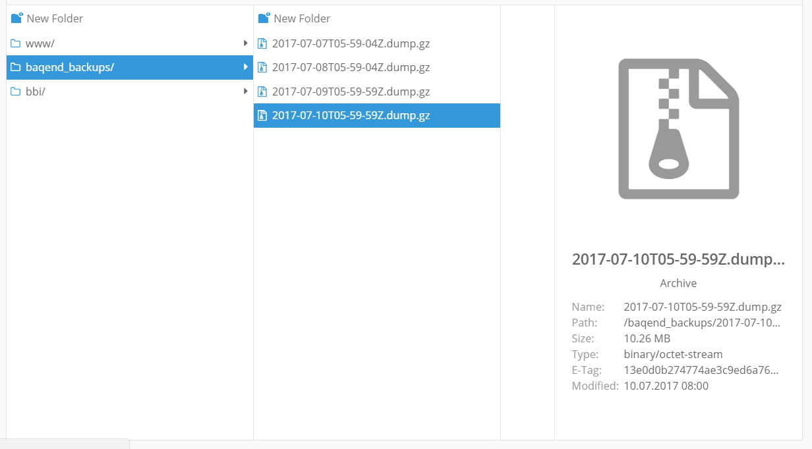

# Backups

Baqend stores all your data in 3 times replicated cluster across multiple availability zones. 
Therefore a data loss is a very unlikely scenario. 
Neitherless losing data can happen by accident or by a programmatic issue. 
Therefore Baqend make periodic backups which you can import into another MongoDB database to select the data which you
want to recover.

## Periodic Backups 

Baqend automatically creates backups weekly for Indie apps and for higher plans on daily basis at 6 clock UTC time. 
It will be provided as a downloadable MongoDB dump archive and is accessible through the `baqend_backups/` file folder.
The used backup storage will be calculated as normal file storage.
The MongoDB backups will be retained for 30 days before they are removed per default. 
This period can be increased if you like by contacting us per mail at [support@baqend.com](mailto:support@baqend.com) or via chat.

## Restoring Backups

Backups currently can't be restored automatically, since they will reset the entire db state to the backup state 
and all modifications which are made after the backup will be lost. 
Instead, you can import the backup into a local MongoDB and afterward you can select the data which you want to recover.
The following step-by-step guide describes how you can recover lost data by using the Baqend Community Edition.

1. Download all required tools

    - Download MongoDB from the official [MongoDB download page](https://www.mongodb.com/download-center#community) 
      or by using the package manager of your OS.
      The official MongoDB installation is required to get the [mongorestore](https://docs.mongodb.com/manual/reference/program/mongorestore/) 
      the command which is later used to import the provided backup. 
      Ensure that you install at least MongoDB version 3.4.
    - Download the latest Baqend Community Editon from our [Download Page](https://www.baqend.com/product.html#download).
    - Install the Baqend CLI as described in the [Baqend CLI](../cli/) guide section.
    

2. Start you local Baqend Server

    - Remove the `state.json` from data directory, to remove any pre-installed tables from the Community Edition.
    - Start the Baqend Community Edition by launching the baqend.bat or baqend.sh script. 
    - A local version of the Dashboard should be automatically open.
    - Enter the Dashboard by entering the username: `root` and the password `root`
    

3. Copy your Baqend App Schema 
    
    You can use the Baqend CLI to copy the Baqend Schema from you Baqend App into your local Baqend Server. 
    Create a new folder, open a shell and type the following commands:
    
    <pre><code class="bash">baqend schema download &lt;appName&gt;</code></pre>
    
    When the Download command prompt you to provide your user credentials, enter your Baqend Account credentials.
    
    <pre><code class="bash">baqend schema upload http://localhost:8080/v1</code></pre>
    
    When the Upload command prompt you to provide your user credentials, enter the username `root` and the password `root`.
    
    Reload The dashboard, you should see your custom Data tables now.
    

4. Get the latest MongoDB Backup

    - Open the [Baqend Dashboard](https://dashboard.baqend.com/apps) 
    - Enter your app and open the File Explorer
    - Download the backup which contains the data which you want to recover  
    
    
    

5. Restore the MongoDB Backup

    Enter your MongoDB Backup download folder and entering the following command:
    
    <pre><code class="bash">mongorestore --gzip --archive=&lt;archiveDate&gt;Z.dump.gz --nsFrom &lt;appName&gt;.\* --nsTo local.\*
    </code></pre>

    Ensure that the data are imported into the `local` database which is used by the Community Edition.
    If you get an error that `mongorestore` is an unknown command, ensure that the mongorestore binary is in your `PATH`.
    
    Open the Dashboard of the Community Edition and the recovered Data should appear. 
    You can now play back single Objects or an entire Table to your Baqend App 
    by using the [Export and Import](../crud/#exporting-and-importing-tables) functionality.

 