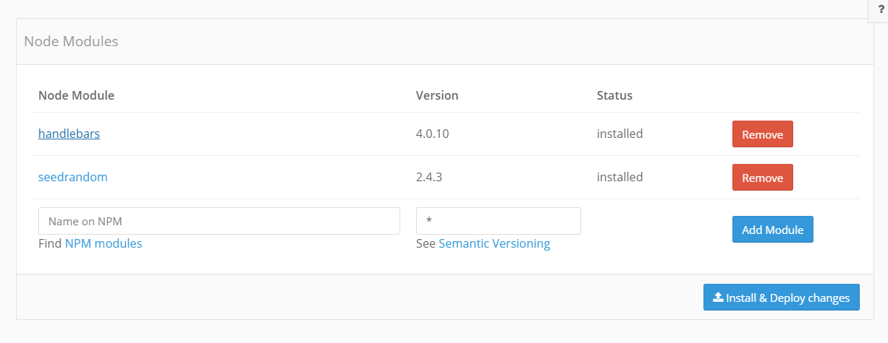

# Baqend Code

Baqend Code Handlers and Modules are JavaScript (Node.js) functions that can be defined in the dashboard and get 
evaluated on the server side. They come in handy when you need to enforce rules and cannot trust clients.

## Handlers

With handlers you are able to intercept and modify CRUD operations sent by clients. To register a handler, open the
handler page of a class on the dashboard. There are four tabs, one for each of the three basic data manipulation 
operations and onValidate for easily validation. Each tab has an empty function template that will be called before 
executing the operation. Here you can perform secure validations or execute additional business logic.

### onValidate

onValidate gets called before an insert or update operation. It is a lightweight method to validate field values.
The function is propagated into the client-side Baqend SDK and can be called on the client to validate inputs without
rewriting the validation logic. The validation library [validatorJs](https://github.com/chriso/validator.js) helps 
keeping validation simple and readable. The onValidate method gets a validator object for each field of the entity, 
which keeps all available validation methods.
```js
function onValidate(username, email) {
 username.isLength(3, 15);
 //An error messages can be passed as first argument
 email.isEmail('The email is not valid') 
}
```
To validate objects on the client device call `object.validate()` in your application. It returns a result object 
containing the validation information.

```js
user.username = "john.doe@example.com";
const result = user.validate();
if (result.isValid) {
  //true if all fields are valid
} 

const emailResult = result.fields.email;
if (!emailResult.isValid) {
  //if the email is not valid, the errors can be retrieved from the error array
  console.log(emailResult.errors[0]) //'The email is not valid'
}
```

It is also possible to write custom validators. You can use the `is` validator the write custom validators:
```js
function onValidate(password, passwordRepeat) {
 password.is('The passwords does not match', function(value) {
   return value != passwordRepeat.value; 
 }); 
}
```

```js
user.password = "mySecretPassword";
user.passwordRepeat = "mySecretPasswort";
const result = user.validate();

const passwordResult = result.fields.password;
if (!passwordResult.isValid) {
  //if the email is not valid, the errors can be retrieved from the error array
  console.log(passwordResult.errors[0]) //'The passwords does not match'
}
```


### onInsert and onUpdate

If you need complex logic or your validation depends on other objects use the onUpdate and/or onInsert handler. The 
handler's this object as well as the second argument are the object which is inserted or updated. All attributes can be 
read and manipulated through normal property access. The requesting user can be retrieved through `db.User.me`. 
Inside Baqend Code the user is an unresolved object just like all other 
referenced objects. If you need to read or manipulate attributes, `.load()` the user first. Consider for example the 
case of maintaining the total time spent on a todo in a dedicated field (e.g. for sorting):

```js
exports.onUpdate = function(db, obj) {
  if (obj.done) {
    //ensure that you always return promises of asynchronous calls, 
    //otherwise errors will not abort the update operation
    return db.User.me.load().then(function(user) {
      obj.activities.forEach(function(activity) {
        user.workingTime += activity.end.getTime() - activity.start.getTime();
      });
      return user.save();
    });
  }
}
```
Since its possible to reactivate finished tasks, we might want to check if we need to decrease the counter. This is only
necessary if the last status of the Todo object was done. To get the state of the object before the current update 
(before image) use `db.load(objectID)`. `obj.load()` on the other hand would refresh the state of object currently 
under update to the previous state.

```js
exports.onUpdate = function(db, obj) {
  return db.Todo.load(obj.id).then((oldTodo) => {
    if (oldTodo.done != obj.done) {
      return db.User.me.load().then((user) => {
        const totalTime = obj.activities.reduce((time, activity) => {
          return time + activity.end.getTime() - activity.start.getTime();
        }, 0);

        if (obj.done) {
          user.workingTime += totalTime;
        } else {
          user.workingTime -= totalTime;
        }

        return user.save();
      });
    }
  });
}
```

It is also possible to change the actual object in the `onInsert` and `onUpdate` handler before it is saved. While 
issuing the insert/update from the SDK you will not get this changes back by default. To get the changed data back, use 
the refresh flag of the `save()`, `insert()` or `update()` method.

```js
//the Baqend handler
exports.onUpdate = function(db, obj) {
  obj.counter++;
}
```

```js
//on client side without refresh
DB.Test.load('546c6-a...').then((obj) => {
  return obj.save();
}).then((obj) => {
  //obj.counter == 0
});

//on client side with refresh
DB.Test.load('546c6-a...').then((obj) => {
  return obj.save({refresh: true});
}).then((obj) => {
  //obj.counter == 1
});
```

<div class="note"><strong>Note:</strong> Inside Baqend Code data operations (e.g. <code>user.save()</code>) have the access rights of the user starting the 
request enhanced by an additional <code>node</code> role. Calls to Baqend originating from handlers will not trigger another 
<code>onUpdate(db)</code> call. See <a href="../user-management/#predefined-roles">Predefined Roles</a> for more details.</div>

### onDelete

The onDelete handler is called with an empty object only containing the id of the deleted object. The method can
for instance be used to log information or delete related objects. 

```js
exports.onDelete = function(db, obj) {
  obj.id   // the id of the object which will be deleted
  obj.name // null
}
```

All four handlers are `before`-operation handlers. Be aware that they are called after the class level permissions are 
checked, but before object level permissions were validated. Thus, making changes to other objects inside handlers 
should be treated with care: these operations could succeed while the original operation might fail due to missing 
object access rights. An elegant way to simplify such cases is the use of `after`-handlers, one of our [Upcoming Features](../roadmap).


## Modules

Baqend Modules are JavaScript modules stored in Baqend. They can be called by 
clients and be imported by other modules and handlers. Only modules that export a `call` method can be called by 
clients directly. The Baqend module will get the DB object as the first, data sent by the client as 
the second and the [request](http://expressjs.com/api.html#req) object as the third parameter.

Let's create a simple invite system. To invite a user to an event, the invitation is added to this/her invite list. 
This process needs to be encapsulated in a Baqend modules as it requires write permissions on other users.

```js
//invite
exports.call = function(db, data, req) {
  return db.User.find()
    .equal('username', data.username)
    .singleResult((user) => {
      user.invites.add(data.invite);
      return user.save();
    });
};
```
The `body` parameter passed into the function contains the request payload, i.e. the decoded query parameters of a GET request or the parsed body of a `POST` request.

On the client side, we can now invite a user by its username to our event by invoking the Baqend invite method. Baqend 
modules can be invoked using `get` for reading data and with `post` to modify data. 

- with `get` data is sent with url query parameters of an HTTP GET request (URL size limit: 2KB)
- with `post` data is sent in the body of an HTTP POST request

```js
DB.modules.post('invite', { email: 'peter@example.com', invite: 'My new event' })
  .then(() => {
    // Invite was sent successfully
  });
```    

Baqend modules are also useful for sending messages like E-mails, Push notifications and SMS.


## Scheduled Code Execution

You can schedule any Baqend Module for execution by adding an entry to the `Job.Definition` collection.
 
Simply enter the dashboard, click on `Jobs` in the menu on the left and then click on `Definition`. You are now looking at all **cron jobs** that are defined for your app. To start a job, click `add` and provide the following parameters: 

- **module**: the name of the *Baqend Code module* to execute. 
- **startsAt**: the moment of the first execution. 
- **cronpattern**: a custom scheduling rule that determines when your code will be executed; see [below](#cron-patterns) for details
- **expiresAt** (optional): the moment at which the job is canceled.

To verify that your job is running all right, check the `Job.Status` collection. Your job will write one of the following status values into the collection whenever it is executed:

- `EXECUTING`: The job is currently executing.
- `SUCCESS`: The job was executed without a problem.
- `ERROR`: There was an exception while executing the job.
- `ABORTED`: The job could not be started, for example because you did not provide a module. 

### Cron Patterns

A **cron job pattern** may contain the following:
 
- *asterisks* (`*`), 
- *numbers* (e.g. `3`), 
- *ranges* (e.g. `1-6` or `1-3,5`), 
- and *steps* (e.g. `*/2`).

<div class="note"><strong>Note:</strong> We use a third-party library for code scheduling. See their docs for more details on the supported <a href="https://github.com/kelektiv/node-cron#available-cron-patterns" target="_blank">cron job patterns</a>.</div>

Our cron job patterns adhere to the below structure:

```text
*    *    *    *    *    *
┬    ┬    ┬    ┬    ┬    ┬
│    │    │    │    │    |
│    │    │    │    │    └ day of week (0 - 6)
│    │    │    │    └───── month (0 - 11)
│    │    │    └────────── day of month (1 - 31)
│    │    └─────────────── hour (0 - 23)
│    └──────────────────── minute (0 - 59)
└───────────────────────── second (0 - 59, optional)
```

Here are a few examples for patterns and possible use cases:

- `* */10 * * * *`: Perform a healthcheck every 10 minutes.
- `0 0 20 * * 1-5`: Run a backup every weekday (Monday through Friday), at 8 PM.
- `0 30 12 * * 1,3,5`: Email statistics to your CTO every Monday, Wednesday and Friday, at 12:30 PM.


## Aborting requests
To abort an insert, update, delete or Baqend module invocation, handlers as well as modules may throw an 
`Abort` exception.

```js
exports.onDelete = function(db, obj) {
  throw new Abort('Delete not allowed.', { id: obj.id });
}
```

The Abort exception aborts the request. The optional 
data parameter transfers additional JSON data back to the client. The data can be retrieved from the error 
object passed to the reject handler of the promise.

```js
obj.delete().then(() => {
  // Object was deleted successfully  
}, (error) => {
  error.message // the error message
  error.data.id // the data sent backed to the client
});
```

## Advanced request handling

In addition to the simplified `call(db, obj, req)` method we provide an advanced way to handle requests within Baqend modules.
You can implement GET and POST request handling separately by implementing a equivalent `get(db, req, res)` and 
`post(db, req, res)`. 

<div class="note"><strong>Note:</strong> that the second parameter is the request object and the third parameter is an express 
<a href="http://expressjs.com/api.html#res">response</a> object.</div>

With the request object, you can handle form submissions via get or post
```js
// Handle get submissions
exports.get = function(db, req, res) {
  // Access url get parameters
  const myParam = req.query.myParam;

  res.json(req.query);
};

// Handle post submissions
exports.post = function(db, req, res) {
  // Access form post parameters
  const myParam = req.body.myParam;

  res.json(req.body);
};
```

With the response object, you can send additional response headers and have a better control over the content which will 
be send back. You can use the complete express API to handle the actual request.

```js
exports.get = function(db, req, res) {
  const myParam = req.query.myParam;

  if (db.User.me) {
    // We are logged in
    return db.User.me.load().then(() => {
      // Use the powerful express helpers
      res.status(200);
      res.json({
        myParam: myParam, 
        token: sig(myParam, db.User.me),
        userId: db.User.me.id
      });
    });
  } else {
    // We are anonymous, lets redirect the user to a login page
    res.redirect('http://myApp.baqend.com/login');
    res.send();
  }
};
```

It is important that you send the content back with one of the express `res.send()` helpers. Otherwise the response will 
not be send back to the client. In addition ensure that you return a [promise](/topics/getting-started#promises) when you make asynchronous calls within 
your Baqend module, otherwise the request will be aborted with an error!

## Handling binary data

As a part of the advanced request handling, it is also possible to upload and download binary files in Baqend modules.

To send binary data to your Baqend module, you can specify the 'requestType' option.
With the 'responseType' option you can receive binary data in the specified type from your Baqend module.
This works similar to the file API and you can use all the listed [file types](/topics/files) as 'requestType' and 'responseType' too.

```js
const svgBase64 = 'PHN2ZyB4bWxucz0...';
const mimeType = 'image/svg+xml';

return db.modules.post(bucket, svgBase64, {
  requestType: 'base64',    // Sending the file as a base64 string 
  mimeType: mimeType,       // Setting the mimeType as Content-Type
  responseType: 'data-url'  // Receiving the data as a data-url
}).then((result) => {
  result // 'data:image/svg+xml;base64,PHN2ZyB4bWxucz0...'
});
```

To handle the binary files in a Baqend module, you must process the incoming raw stream directly. The incoming request
object is a node.js [Readable Stream](https://nodejs.org/api/stream.html#stream_readable_streams) and you will receive 
the incoming raw data as [Buffer](https://nodejs.org/api/buffer.html) chunks.

To send binary data back to the client, you should set the Content-Type of the response data with the express 
[res.type()](http://expressjs.com/de/api.html#res.type) method and send the data afterwards.

If you have completed the request handling you need to resolve the previously returned promise to signal the completion 
of the request handling.

```js
//this simple Baqend handler just sends the uploaded file back to the client
exports.post = function(db, req, res) {
  return new Promise((success) => {
    //node gives the file stream as chunks of Buffer 
    const chunks = []; 
    req.on('data', (chunk) => {
      chunks.push(chunk);
    });
    req.on('end', () => {
      const requestData = Buffer.concat(chunks);
      // do something with the requestData
      res.status(200)
          .type(req.get('Content-Type'))
          .send(requestData); //sending some data back
      success();
    });
  });
};
```

## Handling Files

In the Baqend Code you can use the same <a href="../files/">File API</a> as from your client. For Baqend Code we, however, support two additional file content formats, namely <code>stream</code> and <code>buffer</code>.

With the <code>stream</code> format you can for example stream data through your Baqend Code into the database without buffering it, as the following example shows:
```js
const http = require('https');

exports.call = function(db, data, req) {
  return new Promise((success, error) => {
    const httpReq = http.request({
      method: 'GET',
      hostname: data.host,
      path: data.path
    }, success);

    httpReq.on('error', error);
    httpReq.end();
  }).then((stream) => {
    const file = new db.File({parent: '/www', name: data.name});
    const type = stream.headers['content-type'];
    const size = stream.headers['content-length'];
    return file.upload({data: stream, type: 'stream', mimeType: type, size: size});
  });
};
```
This example shows a Baqend Module that sends an HTTP request (<code>httpReq</code>) to download whatever is referenced
by the URL (<code>data.host</code> and <code>data.path</code>). We take the <code>stream</code> from this download and
upload a file with this content into the <code>/www</code> root folder. This happens without buffering the downloaded
data as it is streamed right through to the database.

<div class="note"><strong>Note:</strong> If you stream the file content to the server you always need to specify the file size as shown in the example.</div>

## Importing code and libraries
Baqend code constitutes CommonJS modules and can require other modules and external libraries. 

Baqend modules not exposing a call method can't be called by the client but may be required by 
other modules and handlers.
```js
// myModule
exports.updateMe = function(db) {
  return db.User.me.load().then((user) => {
    user.visits++;
    return user.save();
  });
};
```

Baqend modules are imported through relative require calls and external libraries through absolute 
require calls.

```js
// Require another Baqend module
const myModule = require('./myModule');
// Require an update (or insert, delete, validate) handler from 'MyClass'
const updateHandler = require('./MyClass/update');
// Require the http core module for external http requests
const http = require('http');

exports.call = function(db, data, req) {
  return myModule.updateMe(db);
}; 
```

In Baqend Handlers modules are required from the parent folder. 

```js
// onUpdate              

// Require the module form the parent folder
const myModule = require('../myModule');

exports.onUpdate = function(db, obj) {
  return myModule.updateMe(db);
}; 
```

## Example: rate-limiting calls by IP


Sometimes you will execute code that should not be invoked too frequently, e.g. because you otherwise run into the limits of a third-party API. To rate-limit users based on their IP address, create a new module `rateLimiter`. Make sure, you have the two npm modules `node-cache` and `limiter` installed. The rate limiter will allow a configurable amount of requests per minute and "refill" available requests at a constant rate (token bucket algorithm):

```js
const NodeCache = require('node-cache');
const cache = new NodeCache( { stdTTL: 60*60, checkperiod: 600, useClones : false } );
const RateLimiter = require('limiter').RateLimiter;

/**
 * Checks if an IP address is rate-limited.
 *
 * @param req the request object containing the IP
 * @param reqPerMinute allowed requests per minute
 * @returns {boolean} true if the user is rate limited
 */
exports.isRateLimited = (req, reqPerMinute = 10) => {
    const ip = req.get('X-Forwarded-For');
    let limiter = cache.get(ip);
    if(limiter === undefined) {
        limiter = new RateLimiter(reqPerMinute, 'minute', true);
        cache.set(ip, limiter);
    }
    return !limiter.tryRemoveTokens(1);
};
```

The `rateLimiter` module uses a cache of seen IP addresses that discards user information after 60 minutes. To rate-limit a module or a handler, simply import the rate limiter. For example, to limit a module to 50 calls per minute and user, do this:

```js
const Limiter = require('./rateLimiter');
exports.call = function (db, data, req) {
    //Check if IP is rate-limited
    if(Limiter.isRateLimited(req, 50)) {
        throw new Abort('Too many requests.');
    }
    // do stuff
}
```

## Permissions

Baqend Code is always executed with the permissions of the requesting client. If the requesting user is not logged in, 
all requests made from Baqend code are anonymous. Both anonymous and authenticated invocations are enhanced by the node 
role. This predefined role can be used in class and object ACLs to grant Baqend code additional access rights. 
In addition there are some Baqend API resources which can only be accessed by the admin or the node role. 

A common use cas is to query User objects in baqend code. 
User objects are protected with object ACLs by default. 
That means that you can't query User objects directly in baqend code. 
To modify that behaviour you can grant the node role access in the insert handler of the User.

```js
//the Baqend handler
exports.onInsert = function(db, obj) {
  obj.acl.allowReadAccess('/db/Role/2'); // The Role id 2 represents the node role
}
```
 

## Debugging & Logging

You can easily debug any part of your Baqend Code with the powerful Logging API of Baqend. 
Any uncaught errors and rejected Promises will automatically be logged into the AppLog Table. So keep an eye on it. 

Read more about it in the [Baqend logging chapter](/topics/logging/)

## NPM Node Modules

You can also install and use custom NPM modules in your Baqned code.

### Installing Public NPM Modules

In the navigation bar you can open Backend Code > Node Modules to open the NPM installation UI. You can install custom NPM 
modules starting from the [Start-Up Plan](https://www.baqend.com/pricing.html) upwards. 



In the installation UI you can add new modules by entering the npm package name and selecting the version you want to install. 
After adding the Module by clicking "Add Module" you can add more node modules as needed. 
Complete the installation by pressing the "Install & Deploy changes". 
The Node modules will be installed in background and will be deployed if the installation process succeeds. 
If an error occurred while installing the modules. the installation will be rolled back to the previous state.

<div class="note"><strong>Note:</strong> We are updating your node server from time to time and will reinstall are 
your defined node modules. 
Therfore it is recommanded to specify explicit version so that a later schedulled node module installation does not 
break your production code</div>

<div class="note"><strong>Note:</strong> Currently the installed NPM modules used file space must fit into 200MB.
If you hit that limit please contact us at <a href="mailto:support@baqend.com">support@baqend.com</a> or via chat.</div>


### Pre installed Node Modules

Baqend is shipped with some pre installed Node Modules. The following additional libraries can always be required in Baqend code:

- [http](https://nodejs.org/api/http.html) - Node.js http core library
- [https](https://nodejs.org/api/https.html) - Node.js https core library
- [querystring](https://nodejs.org/api/querystring.html) - Node.js core querystring parsing and serialization library
- [crypto](https://nodejs.org/api/crypto.html) - Node.js core crypto api offers a way of encapsulating secure credentials 
- [zlib](https://nodejs.org/api/zlib.html) - Node.js core zlib api provides compression functionality implemented using Gzip and Deflate/Inflate. 
- [v8](https://nodejs.org/api/v8.html) - Node.js core v8 api provides functionality for node debug purposes.
- [baqend](https://www.baqend.com/js-sdk/latest/baqend.html) - The Baqend SDK
- [express](http://expressjs.com/4x/api.html) - HTTP server
- [twilio](http://twilio.github.io/twilio-node/) - APIs for Text Messaging, VoIP & Voice in the Cloud 
- [lwip](https://github.com/EyalAr/lwip/) - a Light Weight Image Processor for NodeJS
- [node-mailjet](https://github.com/mailjet/mailjet-apiv3-nodejs) [API v3](https://dev.mailjet.com) Official Mailjet API v3 NodeJS wrapper 

More modules may be added from time to time.

