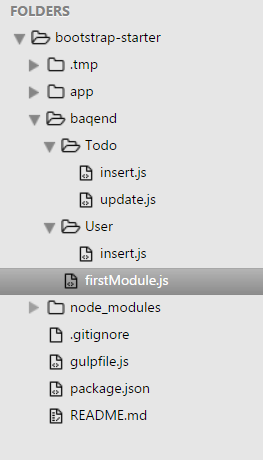

# Baqend CLI

The **CLI** (Command Line Interface) provides a simple way to:

 - Register a Baqend account and start an app 
 - Deploy application assets (HTML, images, CSS, etc.)
 - Register Baqend Code (modules and handlers)

The Baqend CLI can easily be installed globally with `npm install -g baqend` (to get npm you just need to have [Node.JS](https://nodejs.org/en/download/) installed). Afterwards you can use the CLI
by typing `baqend --help` in any folder.

 <div class="note"><strong>Note:</strong> Ensure that your `PATH` system enviroment variable contains the global
 [npm bin path](https://docs.npmjs.com/cli/bin) (`$ npm bin -g`) to let npm installed commands work properly.</div>


 <div class="tip"><strong>Tip:</strong> A good way to manage a Baqend-based project is to manage the files and collaboration via [git](https://git-scm.com/) and using the CLI to deploy files and code to Baqend.</div>

The Baqend CLI is automatically shipped with our SDK. You can use the Baqend CLI directly in any [npm script](https://docs.npmjs.com/misc/scripts).
Therefore add a Baqend script entry to the scripts section in your projects **package.json**

```js
  "scripts": {
    "baqend": "baqend"
  }
```

Afterwards you can type `npm run baqend -- --help`
<div class="note"><strong>Note:</strong> The extra `--` are required to seperate the npm run arguments from the Baqend ones.</div>


## Register, Login, and Logout

Before you can actually deploy assets and code you have to create a Baqend account.
The easiest way to use it is the `baqend register` command.
If you already have an account, you are able login the CLI by typing
`baqend login`.
These commands will save your credentials locally.

If you do not want so save your login credentials, you can skip the login step and provide the login
credentials each time you deploy.

<div class="note">
  <strong>Note:</strong>
  If you have created your Baqend account with OAuth (Google, Facebook, or GitHub), you must add a password to your account first.
  This can be done in the account settings of the dashboard.
</div>

You can logout the Baqend CLI and remove all locally stored credentials by typing `baqend logout`


## Deployment
 
With the `deploy` command, you can upload your static files and assets as well as Baqend Code (modules and handlers) to your Baqend app:

```bash
$ baqend deploy
```

### Deploying Static Files
You can host the static files and assets of your web app on Baqend.
Therefore, move your working directory to your app root folder.
We expect you to have a folder named `www` by default that is uploaded to the `www` folder in [Baqend Files](../files) and served as a website.

<div class="tip">
  <strong>Tip:</strong>
  If you want do upload a different directory, you can use the <code>--file-dir</code> or <code>-f</code> option to specify a directory:
  <code>baqend deploy --file-dir dist</code>.
</div>

The files are then hosted from Baqend.
Read more about **Baqend Hosting** in the [Hosting](../hosting) chapter.

### Deploying Baqend Code
The CLI can additionally deploy your Baqend Code. Baqend code should be located in an folder named `baqend`.
The following screenshot visualizes a typical project layout including Baqend code.

 <div class="clearfix">
    
All Baqend modules should sit top level within the `baqend` folder.
For example, `baqend/firstModule.js` will be uploaded as `firstModule`.

For each code handler you should create a folder named similar to the table 
it belongs to. Within the folder the files should be named:
  
`baqend/<Table>/insert.js` for an [onInsert](../baqend-code#oninsert-and-onupdate) handler <br>
`baqend/<Table>/update.js` for an [onUpdate](../baqend-code#oninsert-and-onupdate) handler <br>
`baqend/<Table>/delete.js` for an [onDelete](../baqend-code#ondelete) handler <br>
`baqend/<Table>/validate.js` for an [onValidate](../baqend-code#onvalidate) handler
       
Therefore `baqend/User/insert.js` contains the insert handler code wich is invoked each time a new user object is inserted
to the `User` table. 

Read more about Baqend code in the [Baqend Code](../baqend-code) chapter.
       
</div>

After deploying your app, you can open it by typing `baqend open` or use the dashboard with `baqend dashboard`.

## TypeScript Support

The Baqend SDK itself comes with a [TypeScript declaration file](https://www.typescriptlang.org/docs/handbook/declaration-files/introduction.html),
which enables seamless integration into TypeScript and allows better code completion.
The SDK comes with a dynamic API part, which is generated on the fly depending on your current schema.
To make your TypeScript application work properly with this dynamic part you can generate the additional typings for your 
current schema with the CLI.

With `baqend typings your-app-name` the CLI generates the TypeScript declaration file in the current folder.
You can then add the generated file to your [tsconfig.json](https://www.typescriptlang.org/docs/handbook/tsconfig-json.html) file.

You can update the generated file each time you have changed tables or fields in the Baqend Dashboard by just repeating this step.

 <div class="tip"><strong>Tip:</strong> You should check the generated file into your version control system to
 share an up-to-date version of the definition file.</div>
