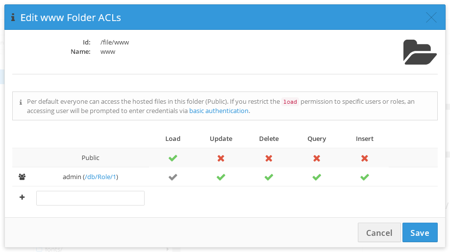

# Hosting

With the hosting feature you can serve your website (html, css, js, images) right from your Baqend cloud instance while using your own domain.

### Public File Access

All assets stored in the **www** root folder can be accessed under your app domain (`<appName>.app.baqend.com`) as in the following examples:


 <div class="table-wrapper"><table class="table">
  <tr>
    <th>Folder (`parent`)</th>
    <th>File Name (`name`)</th>
    <th>Public Url</th>
  </tr>
  <tr>
    <td>www</td>
    <td>index.html</td>
    <td>&lt;appName&gt;.app.baqend.com/</td>
  </tr>
  <tr>
    <td>www</td>
    <td>about.html</td>
    <td>&lt;appName&gt;.app.baqend.com/about.html</td>
  </tr>
  <tr>
    <td>www/images</td>
    <td>logo.jpg</td>
    <td>&lt;appName&gt;.app.baqend.com/images/logo.jpg</td>
  </tr>
</table></div>


<div class="tip">
  <strong>Tip:</strong>
  Baqend hosting works great with <b>static site generators</b> like <a target="_blank" rel="nofollow" href="https://jekyllrb.com/">Jekyll</a>, <a target="_blank" rel="nofollow" href="https://gohugo.io/">Hugo</a>, <a target="_blank" rel="nofollow" href="http://octopress.org/">Octopress</a>, or <a target="_blank" rel="nofollow" href="https://hexo.io/">Hexo</a>. You can start completely static or even import data from CMS like Wordpres.
  Later you can gradually add dynamic parts using the Baqend SDK. From the first static blog post to a highly dynamic site, everything will be cached and accelerated by Baqend.
</div>


### Deployment

To deploy your assets, you can either use the file explorer in the Baqend dashboard (e.g. drag and drop files and folders) or the [**Baqend CLI**](/topics/cli/) for an easy, automated deployment.

### Custom Domains

To serve your website under your own domain, you have to create a DNS entry and register the custom domain in your Baqend dashboard:

1. Log into the account at your domain provider and add a CNAME rule like the following to your DNS entries:

    `www.yourdomain.com. IN CNAME <appName>.app.baqend.com.`

    **Note**: You should not use a top level domain as a CNAME, since many DNS providers do not support it. Instead use a sub domain
such as **www.**yourdomain.com. In addition you should ensure that no other DNS-entry is set for the used domain.

2. Log into your Baqend dashboard and open your app settings. 
   In the Hosting section, simply add your custom domain `www.yourdomain.com` and click the save button. 
   Your domain will now be registered at the CDN. Instead of `<appName>.app.baqend.com` you can now use `www.yourdomain.com`.

3. Optionally, you can define a custom **Domain root folder** (default: `www`). 
   This allows you to host multiple pages on the same Baqend app. 
   Just specify a different file root folder and its content will be served by your custom domain.

Consult your DNS provider's instructions to configure the CNAME record for your domain name. 
The steps to add a CNAME record will vary for each registrar's control panel interface.

If you cannot find your provider's CNAME configuration instructions, Google maintains instructions for [most major providers](https://support.google.com/a/topic/1615038). 


<div class="note"><strong>Note:</strong> The registration of your domain as well as your DNS entry can take a few minutes until they are accessible. If you have trouble configuring your CNAME records, contact us at <a href="maito:support@baqend.com">support@baqend.com.</a></div>
 <div class="note"><strong>Note:</strong> If you can't use a subdomain and want to directly use an <b>apex/naked-domain</b> (such as <code>exmaple.com</code>, without <code>www</code>) 
you should create four <b>A records</b> which point to our Anycast IP addresses:

```
yourdomain.com. IN A 151.101.2.8
yourdomain.com. IN A 151.101.66.8
yourdomain.com. IN A 151.101.130.8
yourdomain.com. IN A 151.101.194.8
```

</div>

### Single Page Apps

#### History API

If you use the <b>History API</b> of your single page app framework (like Angular2 or React), you need to host your <code>index.html</code> also as <code>404.html</code>. This leaves you with the two identical files:
<div class="table-wrapper"><table class="table">
  <tr>
    <th>Folder (`parent`)</th>
    <th>File Name (`name`)</th>
    <th>Public Url</th>
  </tr>
  <tr>
    <td>www</td>
    <td>index.html</td>
    <td>&lt;appName&gt;.app.baqend.com/</td>
  </tr>
  <tr>
    <td>www</td>
    <td>404.html</td>
    <td>Every URL where no file is hosted</td>
  </tr>
</table></div>
This is in order to make sure that ever entrypoint into the app uses the code from your <code>index.html</code>.

If a user for example directly opens a URL like <code>http://yourapp.com/products/42</code> this request needs to be handled by the single page app because there is no hosted HTML file under <code>/www/products/42.html</code>.
The <code>404.html</code> is returned whenever no hosted file is found for a URL (like <code>http://yourapp.com/products/42</code>). By hosting the same code in both your <code>index.html</code> and <code>404.html</code> all entrypoints will be correctly handled.

### SSL Hosting

All data accessed over the Baqend SDK [can be SSL-secured](/topics/getting-started#connect-your-app-to-baqend) by enforcing encryption at connect. 
To enable SSL encryption for your hosted assets as well, generate and activate an SSL certificate for your custom domain.  
To this end, navigate to the "Hosting" section in the dashboard *settings*.  
Here, do the following:

1. Click on **"Request SSL certificate"**:  
This will queue your request for later activation. 
If you plan to request more than one SSL certificate, request all of them first and then activate them in one batch (see next step). 
2. Click on **"Activate SSL certificates"**:  
You may activate several certificates at once, *but you may only start 2 activation processes per day*. 
3. **Confirm**:  
By confirming the activation dialog, your SSL certificate will be activated. Your custom domain is now reachable via `https://yourdomain.com`.

Behind the curtains, we are using [Let's Encrypt](https://letsencrypt.org/) to automate the entire process. 

### Protect your Website with Basic Authentication

It is quite common to protect QA or staging environments with [Basic Authentication](https://en.wikipedia.org/wiki/Basic_access_authentication),
also known as `.htaccess` protection.
If you open the dashboard, navigate to `files`, and click the `Edit Root Folder ACL` button, you can restrict the `load` permission to 
specific roles and/or users. 
For example, if you assign the *load permission* to the `loggedIn` role, only logged-in users will be able to access content hosted in the corresponding directory. 
New Users can be created in the Dashboard **Data &gt; User** table.

<div class="warning"><strong>Root-level permissions:</strong>
Please note that you can only define permissions per root-level folder, i.e. at the granularity of the top level. Second-level (and below) folders inherit the permissions defined for their parents.
</div>



When permissions other than `Public`are assigned, any unauthorized access to the hosted website is prevented: 
When loading a protected site, the accessing user will be asked for login credentials through the browser-native authentication prompt. 
After successful login, a cookie will be set to keep the user logged in for 30 days per default. 
(The login period can be changed in the dashboard under **Settings > Authentication > User Session Length**)

  <div class="note"><strong>Note:</strong> 
If you use the Baqend SDK on the protected page, any authorized user will also be loggedin in after the SDK's `connect` call.
</div>


#### Your Advantages

Here are your advantages at a glance:

- The certificates are *deployed directly at the CDN* which makes the initial handshake **superfast**.
- Once activated, your SSL certificates will be **renewed automatically**, so you don't have to maintain them yourself. 
- **HTTP/2** is activated by default to make your website as fast as possible.
