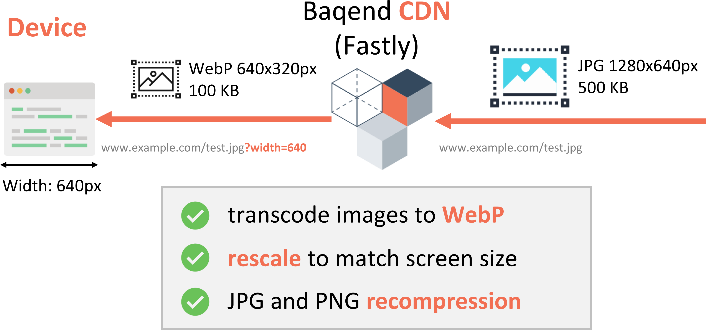

# Automatic Image Optimization

In this section, we describe how automatic image optimization can be used for Baqend Platform. For details on the corresponding feature in Speed Kit, read the [Speed Kit docs on image optimization](../speed-kit/api/#automatic-image-optimization).


## What does it do?

Baqend's automatic image optimization can **transcode** hosted images to the most efficient formats and even **rescale** them to just fit the requesting client’s screen: 



To minimize page size, a user with a high-resolution display will receive high-resolution images, while a users with an old mobile phone will receive a smaller version that is natively scaled to the smaller screen dimensions. 
While imperceptible for the user, these optimizations lead to **significant load time improvements** when bandwidth is scarce, e.g. on mobile connections.

## How does it work?

Baqend's image optimization feature is built on a service provided by our CDN provider **Fastly**. 
It is controlled by simply providing **query parameters** when loading an image, for example `width=640` to re-scale or `quality=90` to re-compress your image on-the-fly: 
```javascript
// original image:
https://www.example.com/test.jpg

// re-sized image:
https://www.example.com/test.jpg?width=640

// re-compressed image:
https://www.example.com/test.jpg?quality=90

// both re-sized and re-compressed image:
https://www.example.com/test.jpg?width=640&quality=90
```

### Parameters

For an extensive list of all the available parameters, please checkout the [**Fastly docs**](https://docs.fastly.com/api/imageopto/). 

<!-- 
If you want to play around with this feature a bit, check out Fastly's image optimization [**sandbox**](https://www.fastly.com/io)!
In the following, you can find an overview of some commonly used parameters:

- **width**: Resizes the image to the specified width in pixels (e.g. `width=640`) or relatively to the original width (e.g. `width=0.3`)
- **height**: Resizes the image to the specified height in pixels (e.g. `height=320`) or relatively to the original height (e.g. `height=0.3`)
- **quality**: Re-compresses the image; accepts values between `1` (low quality) and `100` (high quality)
 -->
