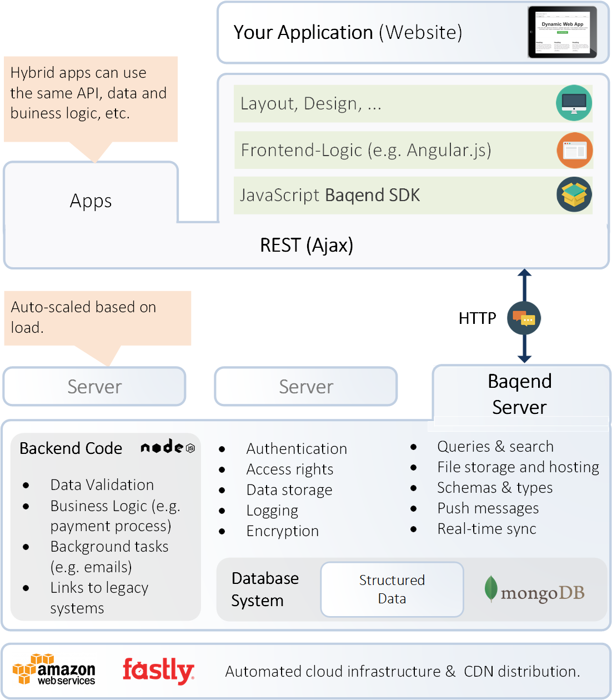

# Overview
Baqend Cloud hosts your application data and business logic and delivers it over a **global caching infrastructure** for performance at the physical optimum. 

With Baqend, you use a fully managed backend service with an automatically accelerated **JavaScript API** directly from your application (e.g. written in Angular or React). As the platform provides a rich set of turnkey features and takes over the responsibility for backend performance, major development efforts are saved.

In terms of **architecture** Baqend gives you the hosting of your application (e.g. HTML and JS files) plus the APIs for backend concerns such as data storage, queries, push, OAuth, user management, access control and server-side business logic:

## Getting Started
These are our recommendations for getting things rolling quickly:

- To get a hands-on overview of how Baqend works, take the [interactive tutorial](https://www.baqend.com/tutorial.html)
- [Start your first Baqend app](https://dashboard.baqend.com/register) and take the Quickstart to build a real application
- With the [Starter Kits](/starters) you get convenient boilerplate projects that work seamlessly with Baqend
- This guide covers how Baqend and the SDK work in depth
