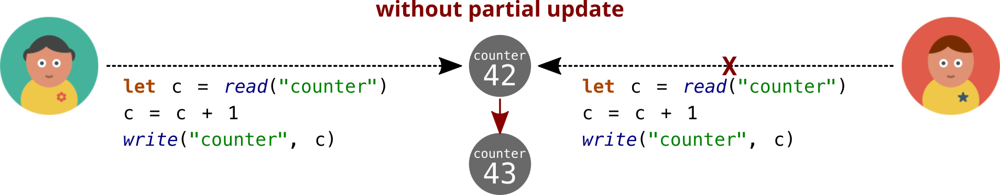

# Partial Updates

The Baqend SDK provides the ability to send **partial updates** to your app’s data model.
They allow you to update an object without reading it before.


## Use Cases

Partial updates help you to improve the concurrency of your app.
Typical situations when you need that are:

1. Your app is under high load and needs a way to speed up writes.
2. Your app does not need to load the object and just wants to increase a counter for example.

Take the following example.
You are counting visits of a page in your app and you have a counter field saving that value in the database.
Normally, you would be implementing that the following way:



But then you would have the problem that both users read the old counter state `42`, increase it, and write `43` to the database.
Of course, Baqend detects such undesired behavior and rejects one of the write operations.
For both users to be counted, the second user than has to retry her operation though.

Now take the example using partial updates:


In a partial update, you specify **operations** to perform on the data without reading it first.
So now, we just tell the database to increment the counter field for us and we will get an up-to-date version of the counter field counting both user’s accesses.


## Using Partial Updates

To use partial updates, you take an entity (which needs not to be loaded) and call the `partialUpdate()`  method on it.
Then, you can use a **fluent interface** to call the below operations on the object.

<div class="note">
  <strong>Node:</strong>
  <span>
    You cannot perform <b>multiple updates on the same field!</b>
    You will have to execute those updates one after another (like in the examples below).
  </span>
</div>

Here is an overview of the supported operations.
Click on the name to see an example and have more detail on their usage.

| Operation                                                            | Allowed Types              | Description |
| -------------------------------------------------------------------- | -------------------------- | ----------- | 
| [`set("field", value)`](#setting-fields)                             | *Any*                      | Sets a given value to the field |
| [`increment("field", by = 1)`](#increment-and-decrement)             | *Integer*, *Double*        | Increments the field by a given value |
| [`decrement("field", by = 1)`](#increment-and-decrement)             | *Integer*, *Double*        | Decrements the field by a given value |
| [`multiply("field", by)`](#multiplication-and-division)              | *Integer*, *Double*        | Multiplies the field by a given factor |
| [`divide("field", by)`](#multiplication-and-division)                | *Integer*, *Double*        | Divides the field by a given divisor |
| [`min("field", value)`](#minimum-and-maximum)                        | *Integer*, *Double*        | Sets the smaller value on a field |
| [`max("field", value)`](#minimum-and-maximum)                        | *Integer*, *Double*        | Sets the higher value on a field |
| [`remove("field", elementOrKey)`](#set-update-operations)            | *List*, *Set*, *Map*       | Removes an element from a list, set or map |
| [`push("field", element)`](#adding-elements-to-lists)                | *List*                     | Adds an element to the end of a list |
| [`unshift("field", element)`](#adding-elements-to-lists)             | *List*                     | Adds an element to the beginning of a list |
| [`pop("field")`](#removing-elements-from-lists)                      | *List*                     | Removes an element from the end of a list |
| [`shift("field")`](#removing-elements-from-lists)                    | *List*                     | Removes an element from the beginning of a list |
| [`replace("field", index, value)`](#replacing-elements-within-lists) | *List*                     | Replaces an element within a list |
| [`add("field", element)`](#set-update-operations)                    | *Set*                      | Adds an element to a set |
| [`put("field", key, value)`](#map-update-operations)                 | *Map*                      | Puts a value to a given key in a map |
| [`toNow("field")`](#date-and-time-update-operations)                 | *Date*, *DateTime*, *Time* | Sets a date field to the current date and time |
| [`and("field", bitmask)`](#bitwise-update-operations)                | *Integer*                  | Performs a bitwise AND on the field |
| [`or("field", bitmask)`](#bitwise-update-operations)                 | *Integer*                  | Performs a bitwise OR on the field |
| [`xor("field", bitmask)`](#bitwise-update-operations)                | *Integer*                  | Performs a bitwise XOR on the field |


## Setting Fields

The most universal update operation which can be used on any kind of value is the **set** operation.
Use it to overwrite a value in the database without reading it first.

```js
function changeNicknameAndAge(userId) {
  return db.User.load(userId)
  .then((user) => {
    const update = user.partialUpdate()
      .set('nickname', 'Alice') // sets "nickname" to "Alice"
      .set('age', 42);          // sets "age" to 42
     
    return update.execute();
  })
  .then((user) => {
    console.log(user.nickname === 'Alice'); // true
    console.log(user.age === 42);           // true
  });
}
```

You can perform partial updates on the **class name**, too.
Therefore, you use the `partialUpdate(id)` method.
The following example is equivalent to the one above.

```js
function changeNicknameAndAgeClassLevel(userId) {
  return db.User.partialUpdate(userId)
    .set('nickname', 'Alice') // sets "nickname" to "Alice"
    .set('age', 42)           // sets "age" to 42
    .execute()
  .then((user) => {
    console.log(user.nickname === 'Alice'); // true
    console.log(user.age === 42);           // true
  });
}
```


## Numeric Update Operations

The following operations can be applied on Double and Integer-typed fields of your object.

### Increment and Decrement

To increment a value of an object by a given number, use the **increment** operation. 

```js
function visitPage(pageId) {
  let oldVisitorCounter, oldHitCounter;
  return db.Page.load(pageId)
  .then((page) => {  
    oldVisitorCounter = page.visitorCounter;
    oldHitCounter = page.hitCounter;
    const update = page.partialUpdate()
      .increment('visitorCounter')  // will increment "visitorCounter" by 1
      .increment('hitCounter', 23); // will increment "hitCounter" by 23
     
    return update.execute();
  })
  .then((page) => {
    // counters are now increased
    console.log(page.visitorCounter === oldVisitorCounter + 1); // true
    console.log(page.hitCounter === oldHitCounter + 23);        // true
  });
}
```

As a shorthand to increment a field by a negative value, you can use **decrement**.
 
```js
function eatCake(cakeId) {
  return db.Cake.load(cakeId)
  .then((cake) => {  
    const pieces = cake.pieces;
    const update = cake.partialUpdate()
      .decrement('pieces');  // will decrement "pieces" by 1
   
    return update.execute();
  })
  .then((cake) => {
    console.log(cake.pieces == pieces - 1); // true
  });
}
```

### Multiplication and Division

You can multiply Double and Integer values by a numeric factor using **multiply** or **divide**. 

```js
function calculateTax(itemId) {
  return db.Item.load(itemId)
  .then((item) => {  
    const price = item.price;
    const update = item.partialUpdate()
      .multiply('price', 1.25);  // will multiply "price" by 1.25
     
    return update.execute();
  })
  .then((item) => {
    console.log(item.price == price * 1.25); // true   
  });
}
```


### Minimum and Maximum

Further numerical operations you can use for Double and Integer-typed values are **min** and **max**.
With min, you update the field to the lower value compared to the one you give and the one stored in the database.
  
```js
function weAreTooExpensive(itemId) {
  return db.Item.load(itemId)
  .then((item) => {  
    const price1 = item.price1; //  5.99
    const price2 = item.price2; //  9.99
    const price3 = item.price3; // 16.99
    const update = item.partialUpdate()
      .min('price1', 9.99)   // will do nothing because 5.99 is lower
      .min('price2', 9.99)   // will do nothing because it's the same value
      .min('price3', 9.99);  // will change "price3" to 9.99
     
    return update.execute();
  })
  .then((item) => {
    console.log(item.price1 == 5.99); // true   
    console.log(item.price2 == 9.99); // true   
    console.log(item.price3 == 9.99); // true   
  });
}
```

To do the same but using the higher value, you can use **max**.

```js
function weAreTooCheap(itemId) {
  return db.Item.load(itemId)
  .then((item) => {  
    const price1 = item.price1; //  5.99
    const price2 = item.price2; //  9.99
    const price3 = item.price3; // 16.99
    const update = item.partialUpdate()
      .max('price1', 9.99)   // will change "price1" to 9.99
      .max('price2', 9.99)   // will do nothing because it's the same value
      .max('price3', 9.99);  // will do nothing because 16.99 is higher
     
    return update.execute();
  }).then((item) => {
    console.log(item.price1 ==  9.99); // true   
    console.log(item.price2 ==  9.99); // true   
    console.log(item.price3 == 16.99); // true   
  });
}
```


## List Update Operations

To ease your work with lists, there are many operations to [add](#adding-elements-to-lists), [remove](#removing-elements-from-lists), or [replace](#replacing-elements-within-lists) elements.

### Adding Elements to Lists

You can **push** to add new elements to the end of a list or **unshift** to add new elements to the beginning of a list.

```js
function addSomePhysicists(scienceId) {
  const science = new db.Science();
  science.name = 'physics';
  science.pioneers = ['Einstein', 'Bohr'];
  science.save()
  .then(() => {
    // add "Newton" before "Einstein"
    return science.partialUpdate()
      .unshift('pioneers', 'Newton')
      .execute();    
  })
  .then(() => {
    // add "Hawking" after "Bohr"
    return science.partialUpdate()
      .push('pioneers', 'Hawking')
      .execute();    
  });
}
```

### Removing Elements from Lists

You can use **pop** to remove an element at the end or **shift** to remove an elements at the beginning of a list.

```js
function removeSomePhysicists(scienceId) {
  const science = new db.Science();
  science.name = 'physics';
  science.pioneers = ['Galilei', 'Newton', 'Schrödinger'];
  
  science.save()
  .then(() => {
    // remove "Galilei"
    return science.partialUpdate()
      .shift('pioneers')
      .execute()    
  })
  .then(() => {
    // remove "Schrödinger"
    return science.partialUpdate()
      .pop('pioneers')
      .execute();    
  });
}
```

### Replacing Elements Within Lists

Furthermore, you can also use **replace** elements within a list to change them.

<div class="note">
  <strong>Note:</strong>
  <span>While you cannot have multiple operations on the same field, you <b>can</b> replace multiple fields in the same list.</span> 
</div>

```js
function replaceSomePhysicists(scienceId) {
  const science = new db.Science();
  science.name = 'physics';
  science.pioneers = ['Galilei', 'Newton', 'Schrödinger'];
  
  science.save()
  .then(() => {
    // replace element with index 2 ("Schrödinger") with "Curie"
    return science.partialUpdate()
      .replace('pioneers', 1, 'Planck')
      .replace('pioneers', 2, 'Curie')
      .execute();    
  })
  .then(() => {
    console.log(science.pioneers); // ['Galilei', 'Planck', 'Curie']
  });
}
```


## Set Update Operations

You can **add** elements into and **remove** elements from a set.

```js
function lookForPlanets(galaxyId) {
  return db.Galaxy.partialUpdate(galaxyId)
    .add('knownPlanets', 'Kepler-186f') // will add "Kepler-186f" to "knownPlanets"
    .execute()
  .then((galaxy) => {
    console.log(galaxy.knownPlanets.indexOf('Kepler-186f') >= 0); // true
    return galaxy.partialUpdate()
      .remove('knownPlanets', 'Pluto') // will remove "Pluto" from the set
      .execute();
  })
  .then((galaxy) => {
    console.log(galaxy.knownPlanets.indexOf('Pluto')); // -1
  })
}
```


## Map Update Operations

You can **put** elements in and **remove** elements from a map.

```js
function updateSolarSystem(galaxyId) {
  return db.Galaxy.partialUpdate(galaxyId)
    .put('planetDistance', 'Earth', '1 au') // assign "1 au" to "Earth"
    .execute()    
  .then((galaxy) => {
    console.log(galaxy.planetDistance['Earth']); // '1 au'
    return galaxy.partialUpdate()
      .remove('planetDistance', 'Pluto') // will remove the "Pluto" key from the map
      .execute();
  })
  .then((galaxy) => {
    console.log(galaxy.planetDistance['Pluto']); // undefined
    return galaxy.partialUpdate()
      .put('planetDistance', { // bulk assign many values to a map
        'Mercury': '0.466 au',
        'Venus': '0.728 au',
        'Mars': '1.6660 au',
      })
      .execute();
  })
  .then((galaxy) => {                                                
    console.log(galaxy.planetDistance['Mercury'] === '0.466 au'); // true
    console.log(galaxy.planetDistance['Venus'] === '0.728 au');   // true
    console.log(galaxy.planetDistance['Mars'] === '1.6660 au');   // true
  });
}
```


## Date and Time Update Operations

*Date*, *DateTime*, and *Time* fields have special update methods.
Use **toNow** to update a field to the current date and time in case of a *DateTime*, to the current time in case of *Time*, or to the current day in case of a *Date* field.
 
```js
function countTheStars(galaxyId) {
  const update = db.Galaxy.partialUpdate(galaxyId)
    .set('amountOfStars', 42)
    .toNow('countedStarsAt'); // assign the current date time to "countedStarsAt"
 
  return update.execute();
}
```


## Bitwise Update Operations

You can also manipulate your Integer fields with **bitwise operations**, e.g. if they store flags or other binary data.

```js
function manipulateRoboParams(robotId) {
  return db.Robot.load(robotId)
  .then((robot) => {  
    console.log(robot.parameter1 === 0b00001111);
    console.log(robot.parameter2 === 0b11110000);
    console.log(robot.parameter3 === 0b00001111);
  
    return robot.partialUpdate()
      .and('parameter1', 0b01010101) // will apply an AND bitmask on "parameter1"
      .or('parameter2', 0b10101010)  // will apply an OR bitmask on "parameter2"
      .xor('parameter3', 0b01010101) // will apply a XOR bitmask on "parameter3"
      .execute();
  })
  .then((robot) => {
    console.log(robot.parameter1 === 0b00000101); // true
    console.log(robot.parameter2 === 0b11111010); // true
    console.log(robot.parameter3 === 0b01011010); // true    
  });
}
```
