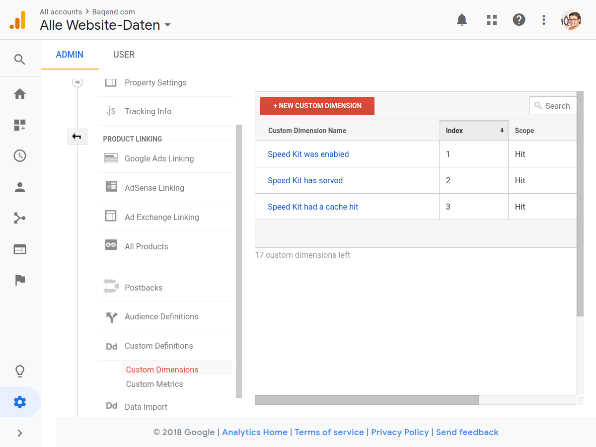

Real User Monitoring (RUM)
==========================

**[Real user monitoring][1]** describes the process to analyze the performance
of your end-users.
With Speed Kit, we provide you with a JavaScript API that allows you to easily
transfer data to your favorite tracking software, such as **Google Analytics**,
**Yandex Metrica** or **mPulse**.


## Metrics for the Current User Navigation

Speed Kit provides you with a [global `SpeedKit` object][2] which is bound to
the `window` object.
This object exposes several properties that allow you to monitor the current
user.
The following table explains the metrics in detail:

| Variable                          | Description                                                                 |
|:----------------------------------|:----------------------------------------------------------------------------|
| `SpeedKit.userId`                 | A unique ID string for this user viewing your website                       |
| `SpeedKit.group`                  | The A/B testing group the user belongs to (either `"A"` or `"B"`)           |
| `SpeedKit.swSupported`            | `true` if this user's browser supports Service Workers                      |
| `SpeedKit.lastNavigate.firstLoad` | `true` if this is the user's first page load                                |
| `SpeedKit.lastNavigate.enabled`   | `true` if Speed Kit was enabled for this navigation                         |
| `SpeedKit.lastNavigate.served`    | `true` if Speed Kit served this navigation (implies `enabled`)              |
| `SpeedKit.lastNavigate.cacheHit`  | `true` if Speed Kit retrieved this navigation from cache (implies `served`) |
| `SpeedKit.lastNavigate.timings`   | The [performance timings](#performance-timings) (see below)                 |


## A/B Testing

One use case for these variables is that you can perform **A/B tests** with your users.
Take for example `SpeedKit.lastNavigate.enabled` as a split criterion for your 
test and find out which performance differences your users experience and how
this changes the conversion.
This allows you to keep an eye on how much Speed Kit increases user engagement
and performance on your website.

To create a target group with a given probability, you can use the [split property][6]
of the Speed Kit configuration.
If you specify e.g. a value of `0.95`, only 95 % all users will be part of
_Group A_ who will receive Speed Kit while all others are part of _Group B_ who 
will not.

In the following example, the target group for our A/B test is determined by
`SpeedKit.lastNavigate.enabled` and `SpeedKit.lastNavigate.firstLoad`.
The latter is needed to exclude first-load visitors from the “inactive” tracking
because they would bias the performance uplift measurements.
This is due to the fact that Speed Kit's Service Worker cannot speed up the first
navigate of a user.
Furthermore, we set the control group to a size of 15% (so 85% will have Speed
Kit enabled).
We use jQuery to await the window to be loaded and report to Google Analytics:

```js
// Specify a config
var speedKit = {
  appName: 'hello-world-123',
  split: 0.85 // 85 % of users will have Speed Kit enabled. 
};

// Speed Kit Snippet
!function(e,n,t,r,i,o){"use strict";/* ... */}

/**
 * Determines the user's target group in an A/B test.
 */
function getTargetGroup() {
  if (SpeedKit.lastNavigate.enabled) {
    return 'SPEED_KIT_ACTIVE';
  }
  
  // Speed Kit cannot serve the first load
  if (SpeedKit.lastNavigate.firstLoad) {
    return 'FIRST_LOAD';  
  }
  
  return 'SPEED_KIT_INACTIVE';
}

// Evaluation using the group
$(function() {
  var timing = performance.timing;
  ga('set', 'dimension1', getTargetGroup());
  ga('set', 'metric1', timing.loadEventEnd - timing.navigationStart);
});
```


## Performance Timings

Besides the above metrics, you also get [timings with millisecond precision][4].
Therefore, Speed Kit provides you the following variables via the global `SpeedKit` object:

| Variable                                    | Description                                                         |
|:--------------------------------------------|:--------------------------------------------------------------------|
| `SpeedKit.lastNavigate.timings.handleStart` | The time at which Speed Kit starts to process the page              |
| `SpeedKit.lastNavigate.timings.handleEnd`   | The time at which Speed Kit finished to process the page            |
| `SpeedKit.lastNavigate.timings.cacheStart`  | The time at which Speed Kit accessed the cache                      |
| `SpeedKit.lastNavigate.timings.cacheEnd`    | The time at which Speed Kit received data from the cache            |
| `SpeedKit.lastNavigate.timings.fetchStart`  | The time at which Speed Kit started to fetch the page from the CDN  |
| `SpeedKit.lastNavigate.timings.fetchEnd`    | The time at which Speed Kit received the page from the CDN          |

You can combine these timings with the [Performance Timing API][5] to get a
complete set of times when certain events occurred for the user.
Use for example `Object.assign` to combine the metrics:

```js
const browserTimings = performance.timing.toJSON();
const speedKitTimings = SpeedKit.lastNavigate.timings;
const timings = Object.assign({}, browserTimings, speedKitTimings);

// e.g., get the complete time until the page needed to be loaded from cache:
console.log(timings.cacheEnd - timings.navigationStart);
```


## Usage with Google Analytics

Use the global `SpeedKit` object to send Service Worker performance
metrics to Google Analytics. When you add
[custom dimensions and metrics to your Google Analytics][3],
you can keep track of how Speed Kit handled and improved your user's perceived performance.



In this example, we added three custom dimensions: _Speed Kit was enabled_,
_Speed Kit has served_ and _Speed Kit had a cache hit_ with the
scope set to “Hit” to our Google Analytics.
After adding these custom dimensions, we can now send values for them using
the `ga` function. This looks like the following:

```js
(function(i, s, o, g, r, a, m) {
  i['GoogleAnalyticsObject'] = r;
  i[r] = i[r] || function() {
        (i[r].q = i[r].q || []).push(arguments)
      }, i[r].l = 1 * new Date();
  a = s.createElement(o),
      m = s.getElementsByTagName(o)[0];
  a.async = 1;
  a.src = g;
  m.parentNode.insertBefore(a, m)
})(window, document, 'script', '//www.google-analytics.com/analytics.js', 'ga');

ga('create', 'UA-XXXXXXXX-Y', 'auto');

// Set the custom dimensions' values
ga('set', 'dimension1', SpeedKit.lastNavigate.enabled);
ga('set', 'dimension2', SpeedKit.lastNavigate.served);
ga('set', 'dimension3', SpeedKit.lastNavigate.cacheHit);

ga('send', 'pageview');
```

You can use these dimensions to compare the performance with Speed Kit
(`dimension2 === true`) to the performance without (`dimentsion2 === false`).
  
Additional to the dimension, you can track custom metrics to capture more details.
In the following example, we added 6 custom metrics to Google Analytics for
the six performance metrics sent by Speed Kit. We then pass the loaded values
to the `ga` function:

```js
// Send Speed Kit performance metrics to Google Analytics
if (SpeedKit.lastNavigate.timings) {
  ga('set', 'metric1', SpeedKit.lastNavigate.timings.handleStart);
  ga('set', 'metric2', SpeedKit.lastNavigate.timings.handleEnd);
  ga('set', 'metric3', SpeedKit.lastNavigate.timings.cacheStart);
  ga('set', 'metric4', SpeedKit.lastNavigate.timings.cacheEnd);
  ga('set', 'metric5', SpeedKit.lastNavigate.timings.fetchStart);
  ga('set', 'metric6', SpeedKit.lastNavigate.timings.fetchEnd);
}
```


[1]: https://en.wikipedia.org/wiki/Real_user_monitoring
[2]: https://www.baqend.com/speed-kit/latest/#SpeedKitGlobal
[3]: https://support.google.com/analytics/answer/2709828
[4]: https://www.baqend.com/speed-kit/latest/#ServiceWorkerTimings
[5]: https://developer.mozilla.org/docs/Web/API/PerformanceTiming
[6]: https://www.baqend.com/speed-kit/latest/#SpeedKitConfig-split
