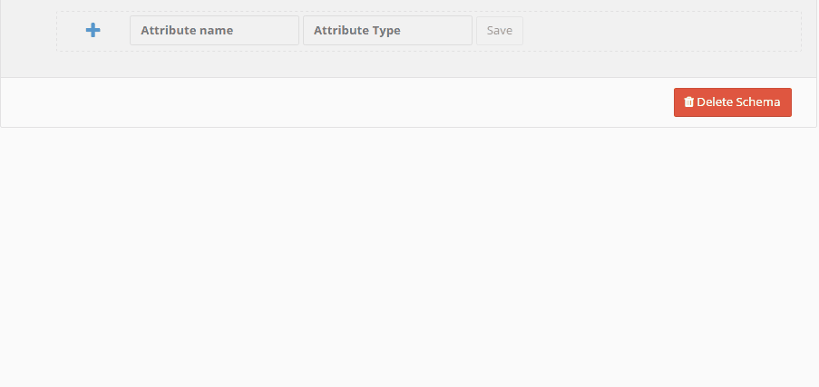

# Schema and Types

Behind each object persisted to and loaded from Baqend there is a *schema* which describes the structure of its 
instances. It specifies which attributes of an object will be tracked and saved (e.g. `Todo.name`, their types (e.g. 
`String` and optionally constraints (e.g. `not null`).

The types that Baqend supports can be classified in five categories.

- [Entities](#entity-objects) are the objects themselves, i.e. instances conforming to the schema
- [References](#references) are references (i.e. links, foreign keys) to other entities.
- [Embeddables](#embedded-objects) are objects that are embedded within other objects (i.e. value objects).
- [Primitives](#primitives) are native types like String, Numbers, Dates and JSON.
- [Collections](#collections) are lists, sets and maps containing any of the previous data types.

## Data Modelling

This section introduces the two basic ways to create your domain model with Baqend:

* Using the [dashboard](#data-modeling-with-the-dashboard), you can define attributes and specify relationships between different entities using a visual interface.
* Alternatively, you can also define and update your model [programmatically](#programmatic-data-modeling), for example as part of automated tests. 

### Data Modeling With The Dashboard

Here is an example for creating the data model of Todo objects in the dashboard:



Under the hood, Baqend stores data in Mongodb. However, in contrast to data modelling in MongoDB, Baqend supports a rich schema that is checked and validated whenever data ist stored. By using the JSON data types Baqend objects can have arbitrary schemaless parts.


<div class="tip"><strong>Tip:</strong> Best practices for <a href="http://martinfowler.com/articles/schemaless">schemaless</a> and <a href="https://en.wikipedia.org/wiki/Relational_model">schema-rich</a> data modelling can both be applied in Baqend by mixing data types with JSON.</div>


### Programmatic Data Modeling

To manipulate your domain model through application code, you first have to connect to your app and authenticate yourself as superuser like so:

```javascript
// Create entity manager factor object:
let emf = new db.EntityManagerFactory({ host: 'your-app-name' });
// Create a db instance that shares its authentication token with the meta model (see below)
let db = emf.createEntityManager(true);
// Wait for the db initialization
await db.ready();
// Login with a user who has admin permissions
await db.User.login("admin", "password");
```

Then, you have to retrieve the meta model (i.e. the *schema*) of your app:
```javascript
// Get your app's metamodel
let metamodel = emf.metamodel;
```

Using the `metamodel`, you can now update your schema in various ways. 
For example, you can create a new entity type (`Person`) and add a string attribute to it (`name`):
```javascript
// You can now add new types to this metamodel
const personType = new db.metamodel.EntityType('Person', metamodel.entity(Object));
metamodel.addType(personType);
//  And lastly you can add attributes to your generated types
personType.addAttribute(new db.metamodel.SingularAttribute('name', metamodel.baseType(String)));
```

When you have specified all desired changes, you have to save your changes to apply them to your Baqend instance:
```javascript
await metamodel.save();
```


### Embedding vs Referencing

The major decision when modelling data in Baqend is the choice between embedding and referencing.

With embedding, related content is stored together. This is also called *denormalization* as the data might be duplicated in multiple places. Embedding is useful for:

- Modelling **contains** relationships. For example a shipping address is "contained" in an invoice object.
- Modelling **one-to-many** (1:n), aggregation and composition relationships. For example a Todo list is composed of multiple todo items.

The advantage of embedding is that data can be read in one chunk making retrieval more efficient. The downside is that whenever embedded objects are contained in multiple parent objects, more than one update has to be made in order to keep all instances of the embedded object consistent with each other.


With referencing, dependent data is not embedded, but instead references are followed to find related objects. In the world of relational database systems this is called *normalization* and the references foreign keys. Referencing is a good choice if:

- Data is used in multiple places.
- For many-to-many (n:m) relationships. For example a "friends with" relationship would best be modelled by a list of references to friend profile objects.
- Deep hierarchies have to be modelled, e.g. the namespace of a file system.

The downside of referencing is that multiple reads and updates are required if connected data is changed. With the `depth`-parameter you can, however, load and save entities with all its references. See [references](#references).

## Entity Objects

In general there are two types of objects. The first type - *Entities* - are those objects which have their own 
identity, version and access rights. They can be directly saved, loaded and updated. Each entity has its own unique 
id. The id is immutable and set at object creation time.

```js
var todo = new db.Todo({name: 'My first Todo'});
console.log(todo.id); //'84b9...'
```

Instead of relying on automatic generation, objects can also have a *custom id*. This allows to assign ids that are 
memorable and meaningful.

```js
var todo = new db.Todo({id: 'Todo1', name: 'My first Todo'});
console.log(todo.id); //'Todo1'
todo.save();
```

<div class="note"><strong>Note:</strong> The save call will be rejected, if the id already exists!</div>

## References

Entity objects can reference other entities by reference, i.e. their id. Referenced objects will not be persisted 
inside another entity, instead only a reference to the other entity is be persisted.
```js
var firstTodo = new db.Todo({name: 'My first Todo'});
var secondTodo = new db.Todo({name: 'My second Todo'});

firstTodo.doNext = secondTodo;
```

To save a reference, you just call the `save()` method on the referencing entity.
```js
//the todo instance will automatically be serialized to a object reference
firstTodo.save();
```

Internally, the reference is converted to a string like `/db/Todo/84b9...` and persisted inside the referencing entity. The referenced entity will not be saved by default. You can pass the `depth` options flag to the save the complete object graph by 
reachability.
```js
//will also save secondTodo, since it is referenced by firstTodo
firstTodo.save({depth: true});
```

When an entity is loaded from Baqend, referenced entities will not be loaded by default. Instead an unresolved entity
(hollow object) is set for the referenced entity. If you try to access attributes of an unresolved entity, an *object is
 not available* error will be thrown.
```js
//while loading the todo, the reference will be resolved to the referenced entity
db.Todo.load('7b2c...').then(function(firstTodo) {
  console.log(firstTodo.name); //'My first Todo'
  console.log(firstTodo.doNext.name); //will throw an object not available error
});
```

The `isReady` field indicates if an entity is already resolved.
```js
db.Todo.load('7b2c...').then(function(firstTodo) {
  console.log(firstTodo.doNext.isReady); //false
});
```

Calling `load()` on an unresolved entity resolved it, i.e. the referenced object is loaded.
```js
firstTodo.doNext.load(function() {
  console.log(firstTodo.doNext.isReady); //true
  console.log(firstTodo.doNext.name); //'My second Todo'
});
``` 

If the object graph is not very deep, references can easily be resolved by reachability.
```js
//loading the todo will also load the referenced todo
db.Todo.load('7b2c...', {depth: true}).then(function(firstTodo) {
  console.log(firstTodo.name); //'My first Todo'
  console.log(firstTodo.doNext.name); //'My second Todo'
});
```

For further information on persisting and loading strategies see the [Deep Loading](../deep-loading) chapter.

## Embedded Objects
The second type of objects are *embedded objects*. They can be used within an entity or a
collection like a list or map. They do not have an id and can only exist within an entity. Embedded objects are
saved, loaded and updated with their owning entity and will be persisted together with it. Embedded objects thus have
 the structure of a object but the behaviour of a primitive type (e.g. a String). This concept is also known as *value
  types*, *user-defined types* or *second class objects*.

Embedded objects can be created and used like entity objects.
```js
var activity = new db.Activity({start: new Date()});
console.log(activity.start); //something like 'Tue Mar 24 2015 10:46:13 GMT'
activity.end = new Date();
```

Since embeddables do not have an identity, they hold neither an id, version nor acl attribute.
```js
var activity = new db.Activity({start: new Date()});
console.log(activity.id); //undefined
```

To actually persist an embedded object you have to assign the embedded object to an entity and save that outer entity.
```js
var activity = new db.Activity({start: new Date()});
var todo = new db.Todo({name: 'My first Todo', activities: [activity]});
todo.save();
```

## Primitives

Primitives types are the basic attribute types and known from programming languages. Whenever an entity is saved, all
attribute values will be checked against the types described by the schema. This is one of the biggest advantages of 
having a schema: data cannot easily be corrupted as its correct structure is automatically enforced by the schema. 
Please note that the JSON data type gives you full freedom on deciding which parts of a object should be structured 
and which parts are schema free. The following table shows all supported attribute types of Baqend 
and their corresponding JavaScript types.

<div class="table-wrapper"><table class="table">
  <tr>
    <th>Baqend Primitive</th>
    <th>JavaScript type</th>
    <th>Example</th>
    <th width="30%">Notes</th>
  </tr>
  <tr>
    <td>String</td>
    <td>String</td>
    <td>"My Sample String"</td>
    <td></td>
  </tr>
  <tr>
    <td>Integer</td>
    <td>Number</td>
    <td>456</td>
    <td>64bit integer. Fractions are deleted</td>
  </tr>
  <tr>
    <td>Double</td>
    <td>Number</td>
    <td>456.456</td>
    <td>64bit floating point numbers</td>
  </tr>
  <tr>
    <td>Boolean</td>
    <td>Boolean</td>
    <td>true</td>
    <td></td>
  </tr>
  <tr>
    <td>DateTime</td>
    <td>Date(&lt;datetime&gt;)</td>
    <td>new Date()</td>
    <td>The date will be normalized to GMT.</td>
  </tr>
  <tr>
    <td>Date</td>
    <td>Date(&lt;date&gt;)</td>
    <td>new Date('2015-03-15')</td>
    <td>The time part of the date will be stripped out.</td>
  </tr>
  <tr>
    <td>Time</td>
    <td>Date(&lt;datetime&gt;)</td>
    <td>new Date('2015-01-15T13:30:00Z')</td>
    <td>The date part of the date will be stripped out and the time will be saved in GMT.</td>
  </tr>
  <tr>
    <td>File</td>
    <td>File(&lt;fileId&gt;)</td>
    <td>new File('/file/www/my.png')</td>
    <td>The file id points to an uploaded file.</td>
  </tr>
  <tr>
    <td>GeoPoint</td>
    <td>db.GeoPoint(&lt;lat&gt;, &lt;lng&gt;)</td>
    <td>new db.GeoPoint(53.5753, 10.0153)</td>
    <td>You can get the current GeoPoint of the User with <code>GeoPoint.current()</code>. This only works with an HTTPS connection.<br></td>
  </tr>
  <tr>
    <td>JsonObject</td>
    <td>Object</td>
    <td>{"name": "Test"}</td>
    <td rowspan=2">Semistructured JSON is embedded within the entity. Any valid JSON is allowed.</td>
  </tr>
  <tr>
    <td>JsonArray</td>
    <td>Array</td>
    <td>[1,2,3]</td>
  </tr>
</table></div>


## Collections

Collections are typed by a reference, embedded object class or a primitive type. The Baqend SDK 
supports 3 type of collections, which are mapped to native JavaScript arrays, es6 sets and maps:

 <div class="table-wrapper"><table class="table">
  <tr>
    <th>Baqend Collection</th>
    <th>Example</th>
    <th width="50%">Supported element Types</th>
  </tr>
  <tr>
    <td>collection.List</td>
    <td>`new db.List([1,2,3])` or <br> `new Array(1,2,3)`</td>
    <td>All non-collection types are supported as values</td>
  </tr>
  <tr>
    <td>collection.Set</td>
    <td>`new db.Set([1,2,3])` or <br> `new Set([1,2,3])`</td>
    <td>Only String, Boolean, Integer, Double, Date, Time, DateTime and References are allowed as values. Only this
    types can be compared by identity.</td>
  </tr>
  <tr>
    <td>collection.Map</td>
    <td>`new db.Map([["x", 3], ["y", 5]])` or <br> `new Map([["x", 3], ["y", 5]])`</td>
    <td>Only String, Boolean, Integer, Double, Date, Time, DateTime and References are allowed as keys.<br>
    All non collection types are supported as values.</td>
  </tr>
</table></div>

For all collection methods see the MDN docs of 
[Array](https://developer.mozilla.org/de/docs/Web/JavaScript/Reference/Global_Objects/Array),
[Set](https://developer.mozilla.org/de/docs/Web/JavaScript/Reference/Global_Objects/Set) and 
[Map](https://developer.mozilla.org/de/docs/Web/JavaScript/Reference/Global_Objects/Map)
