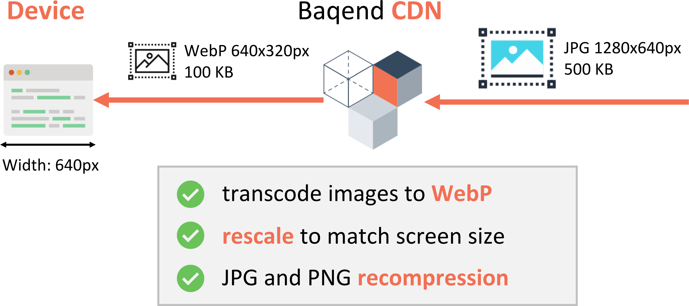

# Automatic Image Optimization

In this section, we describe how automatic image optimization works for Speed Kit. 
For the corresponding feature in Baqend Platform, see the [Platform docs on image optimization](../image-optimization/).


## What does it do?

Speed Kit's automatic image optimization is able to **transcode** accelerated images to the most efficient formats and even **rescale** them to just fit the requesting client’s screen: 



To minimize page size, a user with a high-resolution display will receive high-resolution images, while a users with an old mobile phone will receive a smaller version that is natively scaled to the smaller screen dimensions. 
While imperceptible for the user, these optimizations lead to **significant load time improvements** when bandwidth is scarce, e.g. on mobile connections.

## How does it work? 

This section provides several config examples to illustrate how automatic image optimization can be realized with Speed Kit. 
For an extensive list of all available config parameters, read the [Speed Kit docs on image optimization](../speed-kit/api/#ImageOptions). 


### Example: Recompress all images to 80% quality by default

```javascript

```

### Example: Rescale all images under `"/images/icons/"` to 32px in width

```javascript

```


### Example: Transcode all images under `"/images/photos/"` to WebP with 65% quality

```javascript

```


