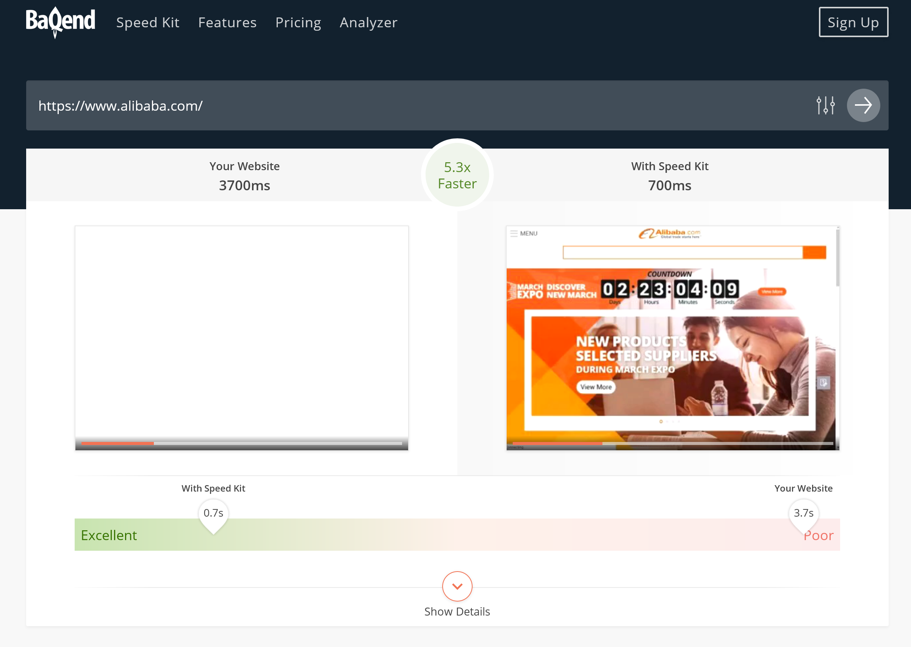

# Speed Kit

**Baqend Speed Kit** accelerate your existing website by rerouting the requests through Baqend´s caching infrastructure.
Thereby you gain a remarkable boost of performance to your website.

You are using WordPress? Check out our [WordPress guide](/topics/wordpress/).

## Why Speed Kit?

Page load time is money. This is not only true for companies like Amazon that loose more than $1.3B in revenue per year,
if their website is a 10th of a second slower. It is also true for publishers, whose business model depends on a user
experience that facilitates consumption of as much content as possible. However, many publishers have heterogenous and
complex technology stacks that make it extremely hard to tackle performance, scalability, and page load time.
Novel browser technologies now offer a means of making web performance as simple as including a script.


Baqend has developed **Speed Kit** that directly hooks into an existing website and makes it **50-300% faster**.
Therefore, Speed Kit uses [Service Workers](https://developers.google.com/web/fundamentals/getting-started/primers/service-workers)
which come with a great **browser support (> 75%)** and automatically enable **offline mode** to your website.
Because it **works for any website**, it is the perfect solution for Publishers, Landing Pages, E-Commerce, and Agencies.

<div class="tip">
    <strong>Tip:</strong>
    Take a closer look at the <a href="#page-speed-analyzer">Page Speed Analyzer</a> and test whether your website can
    benefit from Speed Kit´s potential.
</div>

## Integrating Speed Kit
Follow these 5 steps to set up Baqend Speed Kit and speed up your website.

 <ol class="getting-started-list">
<li>
###Configure Speed Kit
In your account simply enter **your site's URL** as well as all **white- and blacklisted domains**, respectively.
All requests to whitelisted domains are rerouted to Baqend while requests to blacklisted domains will not be speeded up.
A common example of blacklisted domains are those of tracking or ad services.


</li>
<li>
###Integrate code snippet
Insert the **generated code snipped** into the header of your **index.html**. This snipped registers the service worker
that will speed up your requests.


</li>
<li>
###Download Service Worker
[Download](https://www.baqend.com/speed-kit/latest/) the latest Service Worker script from baqend.
</li>
<li>
###Host Service Worker
In order to provide the Service Worker with its full functionality, it needs to have the root
scope. Thus, the Service Worker should be hosted in your root directory.
If you are able to do so, the default case is yours. If for whatever reason this is not possible, we provide
you some implementation options here:
####WordPress
Use our <a href="/guide/topics/wordpress/">WordPress Plugin</a>.
####Apache
Option 1: Rewrite the request url for the service worker to the actual location:
```sh
# Add the following lines to your httpd.conf file
# replace <location> with the actual location of the service worker
RewriteEngine On
RewriteRule ^/sw.js$ <location>
```
Option 2: Customize the service workers registration path by still giving it root scope
```sh
# Add the following lines to your httpd.conf file
<Files "sw.js">
Header Set Service-Worker-allowed "/"
</Files>
# Find this line in your code snipped: "navigator.serviceWorker.register('sw.js')"
# and change it like this:
navigator.serviceWorker.register(<enter your service worker path>, {scope: '/'})
```
####Nginx
Option 1: Rewrite the request url for the service worker to the actual location:
```sh
# Add the following lines to the suitable server or location block in your nginx.conf file
# replace <location> with your actual service worker location
rewrite ^(/sw.js)$ <location> last;
```
Option 2: Customize the service workers registration path by still giving it root scope
```sh
# Add the following lines to your httpd.conf file
# and replace <location> with your service worker location
location  = /<location> {
add_header 'service-worker-allowed' '/';
}
# Find this line in your code snipped: "navigator.serviceWorker.register('sw.js')"
# and change it like this:
navigator.serviceWorker.register(<enter your service worker path>, {scope: '/'})
```
</li>
<li>
###Enjoy Performance
Speed Kit will automatically make your website faster.
</li>
</ol>

## How Speed Kit works

The Baqend Speed Kit hooks into existing websites and reroutes the requests to Baqend for a faster content delivery.
For a deeper understanding of how the Speed Kit works, the following graphic illustrates an overview
of the underlying Speed Kit architecture. 


The left side of the graphic shows your website with the [latest Service Worker script](https://www.baqend.com/speed-kit/latest/)
installed. As soon as the Service Worker is active, all HTTP requests matching your configuration (whitelist, blacklist
etc.) are rerouted to Baqend. If the request has been rerouted to Baqend for the first time, the corresponding resources
(Media, Text etc.) are pulled from your legacy system. Otherwise, the resources are served directly by the server.
 
On the way to the client, resources are routed through the distributed Baqend caching infrastructure and get cached. 
Therefor requests rerouted by the Service Worker can be served with very low latency. Whenever content changes, you call
the [Baqend refresh content API](#refresh-content), so Baqend immediately fetches changed content. Baqend´s caching algorithms automatically
update all caches in real-time (including users' browser caches).

## Refresh Content
If you have changed any kind of content, you need to trigger a Service Worker refresh or else your users will continue
to see the old content. 
## Page Speed Analyzer

The [Page Speed Analyzer](http://makefast.app.baqend.com/) is a testing tool that gives you an impression of
how **Baqend Speed Kit** influences the performance of your website. To this end, the analyzer runs a series
of tests against your website and reports how your current backend stack delivers your website compared to
a version using Speed Kit.



For comparison, the analyzer collects the following metrics by using [Google's PageSpeed Insights API](https://developers.google.com/speed/docs/insights/v1/getting_started)
and private instances of [WebPagetest](https://sites.google.com/a/webpagetest.org/docs/private-instances):

- **Domains:** Number of unique hosts referenced by the page.
- **Resources:** Number of HTTP resources loaded by the page.
- **Response Size:** Number of uncompressed response bytes for resources on the page.
- **Speed Index:** Represents how quickly the page rendered the user-visible content.
- **Time To First Byte:** Measures the amount of time between creating a connection to the server and downloading the contents.
- **DOMContentLoaded:** Represents the time when the initial HTML document has been completely loaded and parsed, without waiting for external resources.
- **FullyLoaded:** Measures the time from the start of the initial navigation until there was 2 seconds of no network activity after Document Complete.
- **Last Visual Change:** Represents the last point in the test when something visually changed on the screen.


Additionally, the tool collects a **performance video** of both website versions to give a visual impression.

<div class="tip">
    <strong>Tip:</strong>
    Customize the analyzer to your desired test situation by switching the location of the client or choosing whether
    to cache or not. You can also provide a comma-separated list of domain patterns to tell Speed Kit which requests it
    should handle.
</div>

<style>
.getting-started-list {
    list-style: none;
    counter-reset: cnt;
    margin-left: 0;
    margin-top: 40px;
}

.getting-started-list ul li{
    padding: 10px 0;
}

.getting-started-list h3 {
    padding-top: 45px;
    position: relative;
    z-index: 1;
}

.getting-started-list>li {
    position: relative;
    border-left: 2px solid #1967CC;
    padding: 0 0 30px 50px;
    /* disable collapsed margin */
    display: inline-block;
    width: 100%;
}

.getting-started-list>li:last-child {
    border: none;
}

.getting-started-list>li:before {
    counter-increment: cnt;
    content: counter(cnt);
    position: absolute;
    left: -18px;
    border-radius: 50%;
    background-color: #FFFFFF;
    display: block;
    width: 35px;
    height: 35px;
    line-height: 31px;
    color: #1967CC;
    border: 2px solid #1967CC;
    text-align: center;
    font-size: 21px;
}
</style>
