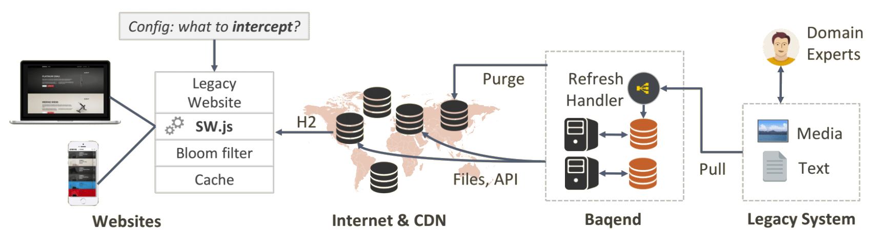

# Speed Kit

**Baqend Speed Kit** accelerates your existing website by rerouting the requests through Baqend´s caching infrastructure.
Using the configuration described in this document, it works for any website and achieves a performance boost of typically 50-300%.

### In a nutshell
You can add Speed Kit to your site at any time and remove it within seconds, should you ever want to. 
Using Speed Kit involves these simple steps described in this guide:

1. **Tell Speed Kit the domain to make fast**<br>
   In your Baqend account simply configure which domains and URLs Baqend should accelerate.
2. **Include the code snippet**<br>
   The snippet provides a Service Worker script that reroutes your existing website's requests through Baqend's caching infrastructure.
3. **Define Refresh Patterns**<br>
   Define how your content is updated either by simple rules (e.g., refreshed every minute) or by calling the Baqend API from your backend.
4. **Speed Kit in Action**<br>
   Your website will be roughly 50-300% faster as Baqend automatically applies network optimizations and sophisticated caching.

### Using WordPress?
Are you using WordPress? Check out our [WordPress guide](/topics/wordpress/).
Baqend has special support for WordPress with a custom plugin that allows you to run your WordPress blog blazingly fast on Baqend with a simple setup.

## Why Speed Kit?

Page load time is money.
This is not only true for companies like Amazon that loses more than 1.3B USD in revenue per year, if their website is a 10th of a second slower.
It is also true for publishers, whose business model depends on a user experience that facilitates consumption of as much content as possible. 
However, many brands, publishers, and e-commerce businesses have heterogeneous and complex technology stacks that make it extremely hard to tackle performance, scalability, and page load time.
Novel browser technologies now offer a means of making web performance as simple as including a script.


Baqend has developed **Speed Kit** that directly hooks into an existing website and makes it **50-300% faster**.
Therefore, Speed Kit uses [Service Workers](https://developers.google.com/web/fundamentals/getting-started/primers/service-workers)
which come with a **browser support of > 75%** and automatically enable an **offline mode** for users of your website.
Because it **works for any website**, it is the perfect solution for Publishers, Landing Pages, E-Commerce, Brands, and Agencies.

<div class="tip">
    <strong>Tip:</strong>
    Test your site with the <a href="#page-speed-analyzer">Page Speed Analyzer</a> to learn whether your website can
    benefit from using Speed Kit.
</div>

#### Learn More
For further information on Speed Kit check out these two resources:

- [Speed Kit Pitch deck (PDF)](speed-kit.pdf)
- [Two-Pager (PDF)](2-pager.pdf)

## Integrating Speed Kit
Follow these 5 steps to set up Baqend Speed Kit and speed up your website.

 <ol class="getting-started-list">
<li>
###Configure Speed Kit
In your account simply enter **your site's URL** as well as all **whitelisted and blacklisted domains**, respectively.
All requests to whitelisted domains are rerouted to Baqend while requests to blacklisted domains will not be speeded up.
A common example of blacklisted domains are those of tracking or ad services.


</li>
<li>
###Integrate code snippet
Insert the **generated code snipped** into the header of your **index.html**.
This snipped registers the service worker that will speed up your requests.


</li>
<li>
###Download Service Worker
[Download](https://www.baqend.com/speed-kit/latest/) the latest Service Worker script from baqend.
</li>
<li>
###Host Service Worker
In order to provide the Service Worker with its full functionality, it needs to have the [root
scope](https://developer.mozilla.org/en-US/docs/Web/API/Service_Worker_API/Using_Service_Workers).
Thus, the Service Worker should be hosted in your root directory.
If you are able to do so, the default case is yours. 
If for whatever reason this is not possible, we provide
you some implementation options here:
####WordPress
Use our <a href="../wordpress/">WordPress Plugin</a>.
####Apache
Option 1: Rewrite the request url for the service worker to the actual location:
```sh
# Add the following lines to your httpd.conf file
# replace <location> with the actual location of the service worker
RewriteEngine On
RewriteRule ^/sw.js$ <location>
```
Option 2: Customize the service workers registration path by still giving it root scope
```sh
# Add the following lines to your httpd.conf file
<Files "sw.js">
Header Set Service-Worker-allowed "/"
</Files>
# Find this line in your code snipped: "navigator.serviceWorker.register('sw.js')"
# and change it like this:
navigator.serviceWorker.register(<enter your service worker path>, {scope: '/'})
```
####Nginx
Option 1: Rewrite the request url for the service worker to the actual location:
```sh
# Add the following lines to the suitable server or location block in your nginx.conf file
# replace <location> with your actual service worker location
rewrite ^(/sw.js)$ <location> last;
```
Option 2: Customize the service workers registration path by still giving it root scope
```sh
# Add the following lines to your httpd.conf file
# and replace <location> with your service worker location
location  = /<location> {
add_header 'service-worker-allowed' '/';
}
# Find this line in your code snipped: "navigator.serviceWorker.register('sw.js')"
# and change it like this:
navigator.serviceWorker.register(<enter your service worker path>, {scope: '/'})
```
</li>
<li>
###Enjoy Performance
Speed Kit will automatically make your website faster.
</li>
</ol>

## How Speed Kit works

Speed Kit hooks into existing websites and reroutes the requests to Baqend for a faster content delivery.
For a deeper understanding of how the Speed Kit works, the following graphic illustrates an overview of the underlying Speed Kit architecture. 



The left side of the graphic shows your website with the [latest Service Worker script](https://www.baqend.com/speed-kit/latest/)
installed.
As soon as the Service Worker is active, all HTTP requests matching your configuration (whitelist, blacklist etc.) are rerouted to Baqend. 
If the request has been rerouted to Baqend for the first time, the corresponding resources (Media, Text etc.) are pulled from your legacy system.
Otherwise, the resources are served directly by the server.
 
On the way to the client, resources are routed through the distributed Baqend caching infrastructure and get cached. 
Therefor requests rerouted by the Service Worker can be served with very low latency.
Whenever content changes, you call the [Baqend refresh content API](#refresh-content), so Baqend immediately fetches changed content. 
Baqend´s caching algorithms automatically update all caches in real-time (including users' browser caches).

## Defining what to Cache: Whitelisting and Blacklisting

To control which requests shall be intercepted by the Service Worker, the definition of a white- and blacklist is
highly recommended.
All requests to whitelisted domains are rerouted to Baqend while requests to blacklisted domains are
ignored by the Service Worker and served normally.
A common example for a whitelisted domain is a third party domain (e.g. example-cdn.com), which serves static content like images.
As a rule, these domains offer great potential for optimization with regard to web performance.
Tracking-Domains or Ad-Domains, on the other hand, are typically hard to cache and should be blacklisted.

To configure the whitelist and blacklist Baqend provides you [SpeedKitRule](#SpeedKitRule).
With this syntax you are able to formulate complex rules for an individual whitelist and blacklist.
Imagine your website loads some images over the third-party domain `img.example-cdn.com`. 
In general, you want all resources whose content type is image to be served via Speed Kit.
For this case a valid whitelist could look like this:

```js
whitelist: [
    // Only apply Speed Kit on URLs whose content type matching "image"
    { contentType: 'image' }
]
```

Further examples can be found in our [Configuration Examples](#Configuration-Examples).

## Refreshing Content

If you have changed any kind of content of your website, you need to trigger a Service Worker refresh. 
Otherwise, the client continues to see previous website content. 
For that purpose, Baqend provides you a refresh API that empowers you to specify which specific content needs to be updated. 
To trigger a Service Worker refresh you can use [Push-Based](#push-based-refreshing) or [Pull-based](#pull-based-refreshing) refreshing.

### Push-Based Refreshing

The optimal way to refresh your cached content is to call our REST-API directly from your system when something changed on your website. 
The REST-Endpoint is `https://<your-app-name>.app.baqend.com/v1/asset/revalidate` and you need a User-Access-Token to be sent with the POST-Request. 
For now, to get this token, you have to login into your Baqend App on our [dashboard](https://dashboard.baqend.com) and open your browser's developer console. 
Use the developer console to call `DB.token` to receive your token. Now you have to add an authorization header to your request which looks like this:

    authorization: BAT <your-token>
    
<div class="note">
    <strong>Note:</strong>
    The token is only valid for 24 hours. The process to get a long life User-Access-Token will change shortly and will become way more comfortable. As soon as this update hits we will inform every customer as well as update this section.
</div>

The refresh API takes a filter object as JSON to configure the refresh process. In case your filter object is an empty JSON object we will just refresh all files on our system. If you are aware of which files have been changed, you can optimize the refresh process by telling us so. 
To do so, we provide you with the following options:

* `contentTypes: string[]` – takes an array of comma-separated strings. Available types are:
    - document (HTML files) 
    - style (CSS files)
    - script (JavaScript files)
    - Feed
    - Audio
    - Video
    - Image
    - Font
* `urls: string[]` - takes an array of comma-separated URLs or URL-Prefixes. Prefixes must end with an *.
* `query: {}` - takes a JSON-Object which represents a real MongoDB query. You can configure the following parameters within this object:
    - url
    - eTag
    - lastModified
    - contentType
    - mediaType

<div class="note">
    <strong>Note:</strong>
    See the <a href="https://docs.mongodb.com/manual/tutorial/query-documents/">MongoDB documentation</a> for more information on MongoDB queries.
</div>

To wrap it up here are some use cases to provide you with examples for what is described above:

- You want to refresh all HTML files:

        {
            "contentTypes": ["document"]
        }

- You want to refresh all URLs, which starts with `https://www.example.com/assets`:

        {
            "urls": ["https://www.example.com/assets*"]
        }
        
- You want to refresh your home page:
        
        {
            "urls": ["https://www.example.com", "https://www.example.com/"]
        }
        
- You want to configure your own advanced query to refresh files with a specific media type:
        
        {
            "query": {
                "mediaType": "text/plain"
            }
        }


### Pull-Based Refreshing

To manually trigger a Service Worker refresh you can create custom refresh filters in your [dashboard's](https://dashboard.baqend.com)
"Refresh Content" section.
When creating a refresh filter you have several options to specify, which content should be refreshed.
As default, all content will be refreshed.
As first you can choose which kind of content should be affected by the appropriate filter.
Therefore a list of possible content types (HTML, CSS, JavaScript, etc.) is provided to you.
The second option allows you to specify the URL´s to be handled by the refresh filter.
These URL's can be entered in a specific way like `https://www.baqend.com` or by using a prefix like `https://www.baqend.com/assets/*` (refresh all files under `https://www.baqend.com/assets/`).

As an advanced setting, it is also possible writing your own [MongoDB Query](https://docs.mongodb.com/manual/tutorial/query-documents/)
to address more complex scenarios. In the following, you can see which attributes are addressable within your individual query. 
<ul>
    <li>url</li>
    <li>eTag</li>
    <li>lastModified</li>
    <li>contentType</li>
    <li>mediaType</li>
</ul>
After you have finished configuring your refresh filter, you can run it.
A status in the dashboard informs you if the refresh was successful.
Refresh filters that have already been executed are saved in your history and can be run again at any time.

<div class="note">
    <strong>Note:</strong>
    In the next weeks, we will release our CRON-Jobs feature, which allows configuring time-based refreshing.
</div>

## Speed Kit API

<div id="speedKitDoc"></div>

## Page Speed Analyzer

The [Page Speed Analyzer](http://makefast.app.baqend.com/) is a testing tool that gives you an impression of
how **Baqend Speed Kit** influences the performance of your website.
To this end, the analyzer runs a series of tests against your website and reports how your current backend stack
delivers your website compared to a version using Speed Kit.
To test the performance improvement after the Speed Kit was integrated into your website, use the
[before and after Speed Kit](#before-and-after-speed-kit) functionality.


For comparison, the analyzer collects the following metrics by using [Google's PageSpeed Insights API](https://developers.google.com/speed/docs/insights/v1/getting_started)
and private instances of [WebPagetest](https://sites.google.com/a/webpagetest.org/docs/private-instances):

- **Domains:** Number of unique hosts referenced by the page.
- **Resources:** Number of HTTP resources loaded by the page.
- **Response Size:** Number of uncompressed response bytes for resources on the page.
- **Speed Index:** Represents how quickly the page rendered the user-visible content.
- **Time To First Byte:** Measures the amount of time between creating a connection to the server and downloading the contents.
- **DOMContentLoaded:** Represents the time when the initial HTML document has been completely loaded and parsed, without waiting for external resources.
- **FullyLoaded:** Measures the time from the start of the initial navigation until there was 2 seconds of no network activity after Document Complete.
- **Last Visual Change:** Represents the last point in the test when something visually changed on the screen.


Additionally, the tool collects a **performance video** of both website versions to give a visual impression.

<div class="tip">
    <strong>Tip:</strong>
    Customize the analyzer to your desired test situation by switching the location of the client or choosing whether
    to cache or not. You can also provide a comma-separated list of domain patterns to tell Speed Kit which requests it
    should handle.
</div>

###Before and after Speed Kit

Do you already use Speed Kit and want to measure the achieved performance advantage?
The [Page Speed Analyzer](http://makefast.app.baqend.com/) can also be used to perform a before and after Speed Kit test.
No special configuration is required for this.
The analyzer automatically detects that your website is using the Speed Kit and performs the test accordingly.
As a result, you will see the performance metrics of your website without the integrated Speed Kit compared to the 
current version including the Speed Kit. All customization options are available as usual.

<style>
.getting-started-list {
    list-style: none;
    counter-reset: cnt;
    margin-left: 0;
    margin-top: 40px;
}

.getting-started-list ul li{
    padding: 10px 0;
}

.getting-started-list h3 {
    padding-top: 45px;
    position: relative;
    z-index: 1;
}

.getting-started-list>li {
    position: relative;
    border-left: 2px solid #1967CC;
    padding: 0 0 30px 50px;
    /* disable collapsed margin */
    display: inline-block;
    width: 100%;
}

.getting-started-list>li:last-child {
    border: none;
}

.getting-started-list>li:before {
    counter-increment: cnt;
    content: counter(cnt);
    position: absolute;
    left: -18px;
    border-radius: 50%;
    background-color: #FFFFFF;
    display: block;
    width: 35px;
    height: 35px;
    line-height: 31px;
    color: #1967CC;
    border: 2px solid #1967CC;
    text-align: center;
    font-size: 21px;
}
</style>
