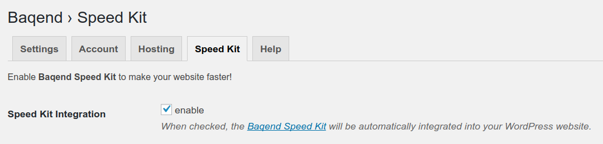

# WordPress Plugin

Baqend has special support for **WordPress** with a custom plugin that allows you to run your WordPress blog blazingly fast on Baqend.

## Install the Plugin

Download the official **Baqend plugin** from [the WordPress Plugin Repository](https://wordpress.org/plugins/baqend/) into your WordPress blog.
You can also look for it in your blog's plugin administration (typically located under *http://your-wordpress.blog/wp-admin/plugin-install.php*) and install it there.
 

## Prepare Your Baqend App

If you have not already, [register at Baqend](https://dashboard.baqend.com/register) and create your app with a name of your choice.
When your app is ready, go to “Settings” in the navigation and find the “Custom Domain” settings in the “Hosting” section.
Add your domain and follow the DNS setup instructions.

## Configure Your WordPress Plugin

Once your Baqend app is prepared, go to the admin page of your WordPress blog and head over to the Baqend settings (located under *http://your-wordpress.blog/wp-admin/admin.php?page=baqend_settings*).
There, enter the credentials you use to login with Baqend.

You can now choose the app you wish to use for the plugin. 
Click on “Select App” and your plugin will be configured for Baqend.

If you want to change the Baqend account, head over to the *Account* tab and click on “Log Out”.

## Speed Kit

The WordPress plugin makes using [Baqend Speed Kit](../speed-kit) a breeze.
Simply head over to the *Speed Kit* tab and check *enabled* next to *Speed Kit Integration*.

Now, you have several options to configure Speed Kit for you:

* **Whitelist**
    - Only the websites given in this list will be handled by Speed Kit. You can also use regular expressions.
* **Blacklist**
    - All websites given in this list will be ignored by Speed Kit. You can also use regular expressions.
* **Content types**
    - Only the given content types will be handled by Speed Kit.
* **Automatic update interval**
    - Automatically triggers a revalidation of Speed Kit.

Click “Save Settings” once you are ready.
